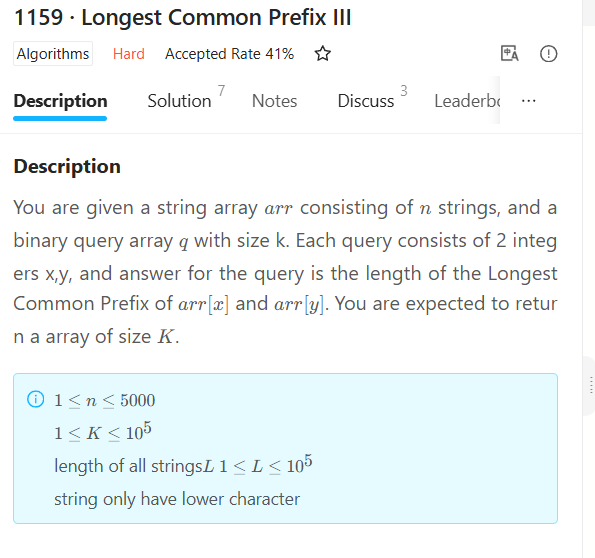

### 1159 · Longest Common Prefix III
Algorithms
Hard
Accepted Rate
41%


### Description
You are given a string array 
a
r
r
arr consisting of 
n
n strings, and a binary query array 
q
q with size k. Each query consists of 2 integers x,y, and answer for the query is the length of the Longest Common Prefix of 
arr[x]
arr[x] and 
arr[y]
arr[y]. You are expected to return a array of size 
K
K.

## (i)

1≤n≤5000
1≤n≤5000
1≤K≤105
1≤K≤105
 
length of all strings
L
L 
1
≤
L
≤
1
0
5
1≤L≤10 
5
 
string only have lower character


## Example
```python
input:["aab","aac","aacd"]
[[0,1],[0,2],[1,2]]
output:[2,2,3]
explation:
arr[0] and arr[1] LCP="aa" length=2
arr[0] and arr[2] LCP="aa" length=2
arr[1] and arr[2] LCP="aac" length=3

```
```python


```
### SOLVE this:

```python
from typing import (
    List,
)

class Solution:
    """
    @param arr: string array
    @param q: query array
    @return: return  LCP ans array
    """
    def query_l_c_p(self, arr: List[str], q: List[List[int]]) -> List[int]:
        # write your code here

```

### Tags
Segment Tree


## Company
Meituan
Amazon

### Related Problems


### best answer
```py
class Solution:
    """
    @param arr: string array
    @param query: query array
    @return: return  LCP ans array
    """
    def common_pre(self, str1, str2):
        cnt = 0  
        for a, b in zip(str1,str2):
            if a != b:
                break
            cnt += 1 
        return cnt 
        
        
    def queryLCP(self, arr, query):
        if not arr or not query:
            return [] 

        res = []
        dic = {}

        for idx1, idx2 in query:
            if (idx1, idx2) in dic:
                res.append(dic[(idx1, idx2)])
            else:
                str1, str2 = arr[idx1], arr[idx2]
                num = self.common_pre(str1, str2)
                dic[(idx1, idx2)] = num 
                res.append(num)
        return res
```

```py
class Solution:
    """
    @param arr: string array
    @param query: query array
    @return: return  LCP ans array
    """
    def common_pre(self, str1, str2):
        cnt = 0  
        for a, b in zip(str1,str2):
            if a != b:
                break
            cnt += 1 
        return cnt 
        
        
    def queryLCP(self, arr, query):
        if not arr or not query:
            return [] 

        res = []
        dic = {}

        for idx1, idx2 in query:
            if (idx1, idx2) in dic:
                res.append(dic[(idx1, idx2)])
            else:
                str1, str2 = arr[idx1], arr[idx2]
                num = self.common_pre(str1, str2)
                dic[(idx1, idx2)] = num 
                res.append(num)
        return res

```

### Official answer from lintcode
题目算法
先将所有字符串按字典序排序

令排完序的字符串数组为str

构造出LcpArr数组 LcpArr[i]表示str[i]和str[i-1]的最长公共前缀

令询问x和y字符串，在排完序的字符串位置为nx ny

询问x和y的最长公共前缀，即询问
m
i
n
(
s
t
r
i
)
n
x
+
1
≤
i
≤
n
y
min(str 
i
​
 )nx+1≤i≤ny 因为已经排过序了，nx和ny的最长公共前缀，一定是
s
t
r
i
n
x
≤
i
≤
n
y
str 
i
​
 nx≤i≤ny的公共前缀，不然不满足排序。
那么我们问题就转换成了如何多次询问区间最小值 即RMQ问题

线段树
对于区间最小值RMQ问题，我们可以使用ST表或者线段树算法，这里给出线段树算法的做法

构造如下的二叉树作为线段树：

叶子节点是原始数组arr中的元素
非叶子结点代表它的所有孩子节点构成区间的最小值 （每个非叶子节点均有左右两个儿子）
例如对于数组
[
2
,
5
,
1
,
4
,
9
,
3
]
[2,5,1,4,9,3]可以构造如下的二叉树（黑线条为叶子节点，蓝线条为非叶子节点，为对应数组区间的最小值）例如根节点表示数组区间
a
r
r
[
0
…
5
]
arr[0…5]内的最小值是1：
20160107193851217.jpg


构造线段树：从根到叶子dfs 叶子节点是原始数组arr中的元素,非叶子节点通过左右儿子节点的最小值得到当前节点的最小值

线段树求最小值：从根节点出发，如果查询区间在当前节点左儿子，则返回递归查询左儿子的答案，如果查询区间在当前节点右儿子，则返回递归查询右儿子的答案，如果两个儿子都有，则两个儿子都要递归处理再求最小值返回答案

复杂度分析
时间复杂度：
n是字符串数量，L是字符串的长度，q是询问次数
线段树初始化**
O
(
n
l
o
g
n
)
O(nlogn)**
线段树单次查询**
O
(
l
o
g
n
)
O(logn)**
字符串排序**
O
(
n
L
l
o
g
n
)
O(nLlogn)**
所以总时间复杂度**
O
(
n
L
l
o
g
n
+
q
l
o
g
n
)
O(nLlogn+qlogn)**

空间复杂度
n是字符串数量
线段树空间复杂度
O
(
n
)
O(n) 总空间复杂度
O
(
n
)
O(n)

```py

class Solution:
    # 线段树初始化函数
    # tree[rt]表示编号为rt的线段树区间的LcpArr的区间最小值
    # LcpArr要查询区间最小值的数组
    # l r rt 线段树区间左端点，线段树区间右端点， 线段树区间编号
    def init(self, tree, LcpArr, l, r, rt):
        if l == r:
            tree[rt] = LcpArr[l]
            return
        # 计算区间中点
        mid = (l + r) // 2
        # 初始化左儿子区间
        self.init(tree, LcpArr, l, mid, rt << 1)
        # 初始化右儿子区间
        self.init(tree, LcpArr, mid + 1, r, rt << 1 | 1)
        # 通过左右区间最小值，算出当前区间的区间最小值
        tree[rt] = min(tree[rt << 1], tree[rt << 1 | 1])

    # 查询区间最小值
    # tree 线段树数组
    # l r rt 线段树区间左端点，线段树区间右端点， 线段树区间编号
    # ql qr查询区间的左右端点
    def queryMn(self, tree, l, r, rt, ql, qr):
        # 如果线段树区间左端点==查询区间左端点 并且 线段树区间右端点==查询区间右端点
        if l == ql and r == qr:
            # 返回区间最小值
            return tree[rt]
        # 计算线段树区间中点
        mid = (l + r) // 2
        # 如果qr<=mid 说明查询区间整个都在线段树左儿子区间内，则返回左儿子区间的答案
        if qr <= mid:
            return self.queryMn(tree, l, mid, rt << 1, ql, qr)

        # 如果ql>mid 说明查询区间整个都在线段树右儿子区间内，则返回右儿子区间的答案
        elif ql > mid:
            return self.queryMn(tree, mid + 1, r, rt << 1 | 1, ql, qr)
        # 不满足上面条件的话 说明查询区间和左右儿子区间都有交集，则分开查询 再取最小值，作为本次的答案
        else:
            return min(self.queryMn(tree, l, mid, rt << 1, ql, mid),
                       self.queryMn(tree, mid + 1, r, rt << 1 | 1, mid + 1, qr))

    """
    @param arr: string array
    @param q: query array
    @return: return  LCP ans array
    """

    def queryLCP(self, arr, q):
        # write your code here

        # 字符串数组长度
        n = len(arr)
        # 询问数组长度
        K = len(q)
        # 答案数组
        ans = []

        # 对字符串进行排序，并存下它在arr数组的下标位置
        # str[i][1] 指i这个字符串在arr数组的下标
        str = []

        # 将arr数组的字符串压入str
        for i in range(n):
            str.append([arr[i], i])

        # 对str数组进行排序，先按字符串字典序升序排序，字典序相同再按下标位置排序
        str=sorted(str)

        # idxTo数组 idx[x]=y表示原arr数组的arr[x]字符串是str数组的str[y]字符串
        idxTo={}

        for i in range(n):
            # 计算出arr[id] 指的是 str[i]这个字符串
            id = str[i][1]
            idxTo[id] = i
        # 线段树数组
        tree = [0 for i in range(4 * n + 1)]

        # 计算相邻字符串的LCP
        # LcpArr[i] 指的是 str数组里 i-1和i的LCP
        LcpArr = [0 for i in range(n + 1)]

        for i in range(1, n):
            lcp = 0
            mn = min(len(str[i][0]), len(str[i-1][0]))
            for j in range(mn):
                if str[i][0][j] == str[i-1][0][j]:
                    lcp = j + 1
                else:
                    break
            LcpArr[i] = lcp
        # 将LcpArr 最长公共前缀长度的数组 存到线段树数组里
		# tree 线段树 数组 LcpArr lcp长度 1 线段树左端点，n-1 线段树右端点，1 线段树当前节点的编号
        self.init(tree, LcpArr, 1, n - 1, 1)
        for i in range(K):
            # 询问的x
            x = q[i][0]
            # 得到arr[x]在str的位置
            x = idxTo[x]

            # 询问的y
            y = q[i][1]
            # 得到arr[y]在str的位置
            y = idxTo[y]

            if x > y:
                tmp = x
                x = y
                y = tmp
            if x == y:
                ans.append(len(str[x][0]))
            else:
                ans.append(self.queryMn(tree, 1, n - 1, 1, x + 1, y))
        
        return ans
```