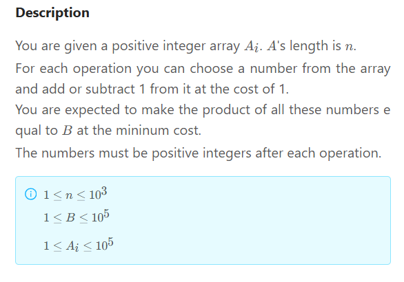

### 1322 · Product Equal B

Algorithms
Hard
Accepted Rate
49%

### Description

You are given a positive integer array
A
i
A
i
​
.
A
A's length is
n
n.
For each operation you can choose a number from the array and add or subtract 1 from it at the cost of 1.
You are expected to make the product of all these numbers equal to
B
B at the mininum cost.
The numbers must be positive integers after each operation.

## (i)

1
≤
n
≤
1
0
3
1≤n≤10
3

1
≤
B
≤
1
0
5
1≤B≤10
5

1
≤
A
i
≤
1
0
5
1≤A
i
​
≤10
5


## Example

```python
input:12
[1,3,5]
output:1
explation: you can change A[2] to 4

```

```python


```

### SOLVE this:

```python
from typing import (
    List,
)

class Solution:
    """
    @param b: the all Ai product equal to B
    @param a: the positive int array
    @return: return the minium cost
    """
    def get_min_cost(self, b: int, a: List[int]) -> int:
        # write your code here

```

### Tags
Coordinate DP
Dynamic Programming/DP

## Company

Apple
Pocket Gems
Amazon
Facebook
Microsoft
Bloomberg
NetEase

### Related Problems

1281
Top K Frequent Elements
Medium

### best answer

```py
inf = float('inf')
class Solution:
    """
    @param B: the all Ai product equal to B
    @param A: the positive int array
    @return: return the minium cost
    """
    def getMinCost(self, b, A):
        factors = []
        m = {}
        for f in range(1, b + 1):
            if b % f == 0:
                factors.append(f)
                m[f] = len(factors) - 1
        dp = [inf] * len(factors)
        dp[0] = 0
        for i in range(len(A)):
            ndp = [inf] * len(factors)
            for j, c in enumerate(factors):
                if dp[j] < inf:
                    for k in range(j, len(factors)):
                        if factors[k] % c == 0:
                            ndp[k] = min(ndp[k], dp[j] + abs(factors[k] // c - A[i]))
            dp = ndp
        return (int)(dp[len(factors) - 1])
```

2

```py
from typing import (
    List,
)

class Solution:
    """
    @param b: the all Ai product equal to B
    @param a: the positive int array
    @return: return the minium cost
    """

# 审题:
    # n的数量级是 1000
    # 每次 操作一个数的话
        # 那每次都2000 种可能性
        # 而 一个 方案 是由  一系列 操作的 序列
        # 所以 k 次操作 就需要
        # 2000^k 种  可能性
        # 太多! 需要降维!

# 思路:
    # 先因式分解?
        # 因子分解的 可能性 也是个 排列 组合
            # 比如 因子 个数 不同 那么 分解结果不同
            # 而且 A list 中 可以 有 多个 1.. 不影响乘积
            #
    #   对于给定的 因式分解
        # A list 距离 它的 最小距离 如何计算?
            # 假设 因式分解有 m 个数
                # 枚举 所有 A 的 m 长度子序列 也很复杂...

# 方法一:(题解)
    # 1. 动态规划
        # 定义:
            # dp[i][j] 前i + 1个数, 变为乘积为 j 需要的 最小 cost
                # 即 前1个数, 下标在i=0 处.
        # 状态转移/递推:
            # dp[i][j] = min(dp[i-1][k] + cost_ijk) for all k <= j
            # 其中 cost_ijk = abs(j // k - a[i])
            # 即分为两步:
                # 前i-1个数 的乘积为 k
                # 第i个数 变成 因子 j // k (前提是可以整除)
                    # 那么 前i个数乘积 就是 k * j // k = j
                # 那么 第i个数的cost就是 从 a[i] 变成 j // k
                    # 即 abs(a[i] - j // k)
            # 求每一个 dp[i][j], 只需要知道 dp[i-1]
                # 并且, 枚举 所有的 k <= j
                    # 取最小的 总 cost
        # 如何选取 j 的值
            # 最终的乘积需要为B
                # 所以 j 的值 只需要枚举所有 B的因子/包括B 即可
                    # 因为如果大于B, 那么 乘积不可能是B
                    # 如果 不是B的因子
                        # 那么 乘以一个整数之后也不可能是B
            # 所以j取值 B的 factors 即可/包括1和本身

        # 空间优化
            # 求 dp[i][j], 只需要知道 dp[i-1][j]
            # 所以不需要矩阵, 只需要 cur_dp 和 prev_dp 即可

        # 推导时, 求 cost_ijk 时, 必须有 j % k == 0
            # 即 可以整除!
                # 才有可能 通过 乘法 进行 转移
            # 另外, 当 dp[i-1][k] 非 inf 时 再进行
                # 否则 求和 仍然是 inf

        # 初始化:
            # dp[0][j] = abs(a[0] - fac[j])
                # fac = list of factors
            # dp 其他初始化 = float('inf')


# 方法一：题解 + 自己理解后代码
    def get_min_cost(self, b: int, a: List[int]) -> int:
        if not b or not a:
            return None
        fac_list = self.get_fac(b)
        fac_list.sort()
        facfac = self.get_facfac(fac_list)
        nb_fac = len(fac_list)
        dp_prev = [float('inf')] * nb_fac
        # at i = 0
        for j in range(nb_fac):
            fac = fac_list[j]
            dp_prev[j] = abs(a[0] - fac)
        n = len(a)

        for i in range(1, n):
            dp_cur = [float('inf')] * nb_fac
            for j2 in range(nb_fac):
                fac2 = fac_list[j2]
                if dp_prev[j2] == float('inf'):
                    continue
                # for j1 in range(j2 + 1): # 因为 fac1 更小, fac_list 先排序
                for j1 in facfac[j2]:
                    fac1 = fac_list[j1]
                    # if fac2 % fac1 != 0:
                    #     continue
                    dp_cur[j2] = min(dp_cur[j2], dp_prev[j1]+abs(fac2 // fac1 - a[i]))
            dp_prev = dp_cur

        return dp_prev[-1] # fac[-1] == b

    def get_fac(self, b):
        import math
        result = []
        for i in range(1, int(math.sqrt(b)) + 1):
            if b % i == 0:
                result.append(i)
            if b // i != i:
                result.append(b // i)
        return result

    def get_facfac(self, facs):
        result = collections.defaultdict(list)
        for i in range(len(facs)):
            for j in range(len(facs)):
                if facs[i] % facs[j] == 0:
                    result[i].append(j)
        return result


# 方法一: 题解 + 题解代码

    # def get_min_cost(self, b: int, a: List[int]) -> int:
    #     # write your code here


    #     # A的长度
    #     n = len(a)
    #     # 存B的因数的数组
    #     factor = []
    #     # 找出B的因子 并存入factor
    #     for i in range(1, b + 1):
    #         if (b % i == 0):
    #             factor.append(i)
    #     # B因子的数量
    #     m = len(factor)

    #     # 初始化dp数组
    #     dp = [sys.maxsize for i in range(m)]

    #     # dp数组边界条件
    #     dp[0] = 0

    #     for i in range(n):
    #         # 初始化本次循环中被更新的dp数组
    #         tmp = [sys.maxsize for i in range(m)]
    #         for j in range(m):
    #             # dp[j]为无穷，无法去更新
    #             if (dp[j] != sys.maxsize):
    #                 # 枚举factor[j]的倍数，将前i个数的乘积由factor[j]变换成factor[k]
    #                 for k in range(j, m):
    #                     if (factor[k] % factor[j] == 0):
    #                         tmp[k] = min(tmp[k], dp[j] + abs(factor[k] // factor[j] - a[i]))

    #         # 交换dp数组 和tmp数组，dp滚动数组优化空间
    #         # 一直用dp数组去更新下一次的tmp数组
    #         dp=tmp
    #     return (int)(dp[m - 1])
```

### Official answer from lintcode

算法一
DP 动态规划

DP 方程状态
d
p
i
j
dp
ij
​
表示通过修改 前 i 个的和的乘积为 j 的最小花费

DP 方程转移

d
p
i
j
=
m
i
n
(
d
p
i
−
1
k

- c
  o
  s
  t
  (
  A
  i
  ,
  j
  /
  k
  )
  )
  dp
  ij
  ​
  =min(dp
  i−1k
  ​
  +cost(A
  i
  ​
  ,j/k))
  转移枚举前 i-1 个数的乘积为 k，然后计算
  A
  i
  A
  i
  ​
  修改为
  j
  /
  k
  j/k 的花费
  这样 前 i-1 个数的乘积为 k，第 i 个数为
  j
  /
  k
  j/k 得到前 i 个数的乘积为 j 的最小花费

边界条件
d
p
00
=
0
dp
00
​
=0
表示前 0 个数构成乘积为 0 的最小花费为 0

答案
d
p
n
B
dp
nB
​
前 n 个数的乘积为 B

复杂度分析
时间复杂度
n 是序列长度 B 是乘积大小
状态量是
O
(
n
B
)
O(nB)
每个状态的转移是
O
(
n
)
O(n)
所以总时间复杂度
O
(
n
2
B
)
O(n
2
B)

空间复杂度
n 是序列长度 B 是乘积大小
空间复杂度
O
(
n
B
)
O(nB)

算法二 DP 优化
时间优化
因为我们要使得最终的乘积结果为 B，那么
d
p
i
j
dp
ij
​
只有当 j 为 B 的因子的时候 才是有用的状态，因为如果 j 不是 B 的因子，那么我们如何修改 i 后面的值，都无法使得 j\*x=B
所以我们可以将方程优化为
d
p
i
j
dp
ij
​
表示通过修改 前 i 个的和的乘积为 B 的第 j 小的因子的最小花费 2. 空间优化
使用滚动数组
滚动数组是 DP 中的一种编程思想。简单的理解就是让数组滚动起来，每次都使用固定的几个存储空间，来达到压缩，节省存储空间的作用。起到优化空间，主要应用在递推或动态规划中（如 01 背包问题）。因为 DP 题目是一个自底向上的扩展过程，我们常常需要用到的是连续的解，前面的解往往可以舍去。所以用滚动数组优化是很有效的。利用滚动数组的话在 N 很大的情况下可以达到压缩存储的作用。

```py
    d[0]=1;
    d[1]=1;
    for(i=2;i<80;i++)
    {
        d[i]=d[i-1]+d[i-2];
    }
```

更改为

```py
    for(i=2;i<80;i++)
    {
        d[0]=d[1];
        d[1]=d[2];
        d[2]=d[0]+d[1];
    }
```

对于本题我们每次都是
d
p
i
−
1
dp
i−1
​
去更新
d
p
i
dp
i
​
即可，所以 i 这一维可以利用滚动数组压缩到 2 即可

DP 动态规划
DP 方程状态
d
p
i
j
dp
ij
​
表示通过修改 前 i 个的和的乘积为 B 的第 j 个因子的最小花费
DP 方程转移
d
p
i
j
=
m
i
n
(
d
p
i
−
1
k

- c
  o
  s
  t
  (
  A
  i
  ,
  j
  /
  k
  )
  )
  dp
  ij
  ​
  =min(dp
  i−1k
  ​
  +cost(A
  i
  ​
  ,j/k))
  转移枚举前 i-1 个数的乘积为 B 的第 k 个因子，然后计算
  A
  i
  A
  i
  ​
  修改为
  f
  a
  c
  t
  o
  r
  j
  /
  f
  a
  c
  t
  o
  r
  k
  factor
  j
  ​
  /factor
  k
  ​
  的花费
  这样 前 i-1 个数的乘积为 B 的第 k 个因子，第 i 个数为
  f
  a
  c
  t
  o
  r
  j
  /
  f
  a
  c
  t
  o
  r
  k
  factor
  j
  ​
  /factor
  k
  ​
  得到前 i 个数的乘积为 B 的第 j 个因子的最小花费

边界条件
d
p
00
=
0
dp
00
​
=0 表示前 0 个数构成乘积为 0 的最小花费为 0
答案
d
p
n
B
dp
nB
​
前 n 个数的乘积为 B
复杂度分析
时间复杂度
n 是序列长度 B 是乘积大小 K 是 B 的因子个数
状态量是
O
(
n
K
)
O(nK)
每个状态的转移是
O
(
n
)
O(n)
所以总时间复杂度
O
(
n
2
K
)
O(n
2
K)

空间复杂度
n 是序列长度 B 是乘积大小
利用滚动数组
空间复杂度
O
(
B
)
O(B)

代码

```py
class Solution:
    """
    @param B: the all Ai product equal to B
    @param A: the positive int array
    @return: return the minium cost
    """

    def getMinCost(self, B, A):
        # write your code here

        # A的长度
        n = len(A)
        # 存B的因数的数组
        factor = []
        # 找出B的因子 并存入factor
        for i in range(1, B + 1):
            if (B % i == 0):
                factor.append(i)
        # B因子的数量
        m = len(factor)

        # 初始化dp数组
        dp = [sys.maxsize for i in range(m)]

        # dp数组边界条件
        dp[0] = 0

        for i in range(n):
            # 初始化本次循环中被更新的dp数组
            tmp = [sys.maxsize for i in range(m)]
            for j in range(m):
                # dp[j]为无穷，无法去更新
                if (dp[j] != sys.maxsize):
                    # 枚举factor[j]的倍数，将前i个数的乘积由factor[j]变换成factor[k]
                    for k in range(j, m):
                        if (factor[k] % factor[j] == 0):
                            tmp[k] = min(tmp[k], dp[j] + abs(factor[k] // factor[j] - A[i]))

            # 交换dp数组 和tmp数组，dp滚动数组优化空间
            # 一直用dp数组去更新下一次的tmp数组
            dp = tmp

        return (int)(dp[m - 1])

```
