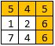
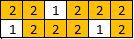
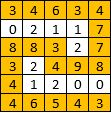

### 1418 · Path With Maximum Minimum Value
Algorithms
Medium
Accepted Rate
55%


### Description
Given a matrix of integers A with R rows and C columns, find the maximum score of a path starting at [0,0] and ending at [R-1,C-1].

The score of a path is the minimum value in that path. For example, the value of the path 8 → 4 → 5 → 9 is 4.

You can move up, down, left and right from the current position，but can't move obliquely.And you can't walk through one point twice.

## (i)
1 <= R, C <= 100
0 <= A[i][j] <= 10^9



## Example
```python
Example1:
Input: [[5,4,5],[1,2,6],[7,4,6]]
Output: 4
Explanation: 
The path with the maximum score is highlighted in yellow. 

```

```python
Example2:
Input: [[2,2,1,2,2,2],[1,2,2,2,1,2]]
Output: 2

```

```python
Example3:
Input: [[3,4,6,3,4],[0,2,1,1,7],[8,8,3,2,7],[3,2,4,9,8],[4,1,2,0,0],[4,6,5,4,3]]
Output: 3

```
### SOLVE this:

```python
from typing import (
    List,
)

class Solution:
    """
    @param a: a List[List[int]]
    @return: Return the maximum score of a path
    """
    def maximum_minimum_path(self, a: List[List[int]]) -> int:
        # Write your code here

```

### Tags
Depth First Search/DFS
Union Find 

## Company
Amazon

### Related Problems


### best answer
1
```py
from heapq import heappush, heappop

DIRECTIONS = ((0, 1), (0, -1), (1, 0), (-1, 0))


class Solution:
    """
    @param A: a List[List[int]]
    @return: Return the maximum score of a path
    """

    def maximumMinimumPath(self, A):
        min_val = A[0][0]
        start, end = (0, 0), (len(A) - 1, len(A[0]) - 1)
        queue = []
        heappush(queue, (-A[0][0], start))
        visited = set()
        visited.add(start)

        while queue:
            val, cur = heappop(queue)
            min_val = min(min_val, -val)
            if cur == end:
                return min_val
            for dx, dy in DIRECTIONS:
                nx, ny = cur[0] + dx, cur[1] + dy
                if not self.is_valid(nx, ny, A):
                    continue
                if (nx, ny) in visited:
                    continue
                heappush(queue, (-A[nx][ny], (nx, ny)))
                visited.add((nx, ny))
        return -1

    def is_valid(self, x, y, A):
        return 0 <= x < len(A) and 0 <= y < len(A[0])

```

2
```py
from typing import (
    List,
)

class Solution:
    """
    @param a: a List[List[int]]
    @return: Return the maximum score of a path
    """
    def maximum_minimum_path(self, A: List[List[int]]) -> int:
        # Write your code here
        import heapq

        R, C = len(A), len(A[0])
        directions = [(-1,0), (1,0), (0,-1), (0,1)]
        
        # Max-Heap (minimized values are stored as negative for max behavior)
        heap = [(-A[0][0], 0, 0)]
        
        # Track the best minimum value for each cell
        min_score = [[-float('inf')] * C for _ in range(R)]
        min_score[0][0] = A[0][0]
        
        while heap:
            score, x, y = heapq.heappop(heap)
            score = -score  # Convert back to positive

            # If we reached the bottom-right, return the score
            if x == R-1 and y == C-1:
                return score

            for dx, dy in directions:
                nx, ny = x + dx, y + dy
                if 0 <= nx < R and 0 <= ny < C:
                    new_min = min(score, A[nx][ny])
                    if new_min > min_score[nx][ny]:  # Only update if it's better
                        min_score[nx][ny] = new_min
                        heapq.heappush(heap, (-new_min, nx, ny))
        
        return -1  # This shouldn't happen if 

```


### Official answer from lintcode
//1
解题思路
对于本题我们可以使用贪心的策略来计算最大最小值。

对于路径得分的最大值，显然我们应该让路径中的最小元素尽可能大。因此我们可以先构造一个由横纵坐标以及单元格值构成的三元组列表 flatten，并将该列表按照单元格值从大到小进行排序。

由于我们需要从大到小遍历单元格，因此我们还需要额外使用一个并查集来记录不同单元格当前的连通关系。以及一个 visited 二维布尔数组来判断单元格是否已被访问（每个单元格访问其上下左右方向的单元格会出现重复访问）。

最后在遍历排好序的 flatten 数组时，我们将当前点标记为已访问，同时检查该点四个方向的邻接点是否已经被访问，如果被访问则将其进行连通。当这个连通块中同时存在 (0，0) 单元格与 (m-1, n-1) 时，则我们找到了包含最大最小值的路径。

完整代码参考题解代码部分。

题解代码
```py
from typing import (
    List,
)

class Solution:
    """
    @param a: a List[List[int]]
    @return: Return the maximum score of a path
    """
    def maximum_minimum_path(self, a: List[List[int]]) -> int:
        # Write your code here
        m, n = len(a), len(a[0])
        self.p = [0] * (m * n)
        flatten = []
        for i in range(m):
            for j in range(n):
                k = i * n + j
                self.p[k] = k
                flatten.append([i, j, a[i][j]])
        flatten.sort(key=lambda x: -x[2])
        ans = float('inf')
        visited = [[False for _ in range(n)] for _ in range(m)]
        directions = [1, 0, -1, 0, 1]
        for i in range(len(flatten)):
            arr = flatten[i]
            y, x, v = arr[0], arr[1], arr[2]
            visited[y][x] = True
            ans = min(v, ans)
            for j in range(4):
                for k in range(4):
                    ny, nx = y + directions[k], x + directions[k + 1]
                    if 0 <= ny < m and 0 <= nx < n and visited[ny][nx]:
                        self.p[self.find(y * n + x)] = self.find(ny * n + nx)
            if self.find(0) == self.find(m * n - 1):
                break
        return ans

    def find(self, x: int) -> int:
        if self.p[x] != x:
            self.p[x] = self.find(self.p[x])
        return self.p[x]
```
//2
Dijkstra 解法, python默认minHeap, 所以加了负号
```py
import heapq
class Solution:
    """
    @param A: a List[List[int]]
    @return: Return the maximum score of a path
    """
    def maximumMinimumPath(self, A):
        # Write your code here
        
        minNum = A[0][0]
        start = (0, 0)
        end = (len(A) - 1, len(A[0]) - 1)
        pq = []
        heapq.heappush(pq, (-A[0][0], start))
        viewed = set()
        points = [(0, 1), (0, -1), (1, 0), (-1, 0)]
        
        while pq:
            num, curr = heapq.heappop(pq)
            minNum = min(minNum, -num)
            viewed.add(curr)
            if curr == end:
                return minNum
                
            for point in points:
                dx = curr[0] + point[0]
                dy = curr[1] + point[1]
                if dx < 0 or dx >= len(A) or dy < 0 or dy >= len(A[0]) or (dx, dy) in viewed:
                    continue
                heapq.heappush(pq, (-A[dx][dy], (dx, dy)))
        
        return -1
```