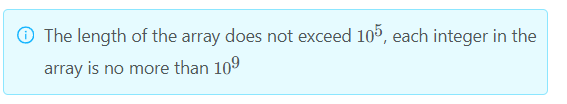

### 1455 · Valid Array
Algorithms
Easy
Accepted Rate
59%


### Description
If an array contains only one integer that appears odd times, the array is valid, otherwise the array is invalid. Given an array a contains only positive integers, please judge wether the array is valid or not. Return the integer which appears odd times if the array is valid, otherwise return -1

## (i)
The length of the array does not exceed 
1
0
5
10 
5
 , each integer in the array is no more than 
1
0
9
10 
9



## Example
```python
Input: a=[1,1,2,2,3,4,4,5,5]
Output: 3
Explanation: 
In this array, only 3 appears odd times, so return 3.

```
```python
Input: a=[1,1,2,2,3,4,4,5]
Output: -1
Explanation: 
In this array, 3 and 5 appear odd times, so it is invalid and return -1.

```
### SOLVE this:

```python
from typing import (
    List,
)

class Solution:
    """
    @param a: The array.
    @return: The number which has odd number of times or -1.
    """
    def is_valid(self, a: List[int]) -> int:
        # Write your code here

```

### Tags
Hash Table
Sort
## Company
Amazon

### Related Problems


### best answer
```py
class Solution:
    """
    @param nums: The array.
    @return: The number which has odd number of times or -1.
    """
    def isValid(self, nums):
        if nums is None or not (len(nums) % 2):
            return -1

        # XOR: a ^ a = 0
        x = 0
        for num in nums:
            x ^= num

        # Count how many x in nums.
        count = 0
        for num in nums:
            if num == x:
                count += 1

        return x if count % 2 else -1
```
```py
from typing import (
    List,
)

class Solution:
    """
    @param a: The array.
    @return: The number which has odd number of times or -1.
    """
    def is_valid(self, nums: List[int]) -> int:
        # Write your code here
        if nums is None or not (len(nums) % 2):
            return -1

        # XOR: a ^ a = 0
        x = 0
        for num in nums:
            x ^= num

        # Count how many x in nums.
        count = 0
        for num in nums:
            if num == x:
                count += 1
        return x if count else -1
```
```py
class Solution:
    """
    @param a: The array.
    @return: The number which has odd number of times or -1.
    """
    def isValid(self, nums):
        # Write your code here
        if nums is None or not (len(nums) % 2):
            return -1

        # XOR: a ^ a = 0
        x = 0
        for num in nums:
            x ^= num

        # Count how many x in nums.
        count = 0
        for num in nums:
            if num == x:
                count += 1

        return x if count % 2 else -1
```


### Official answer from lintcode
用一个dict记录每个不同数字出现的次数，最后遍历一遍即可得出答案
```py
class Solution:
    """
    @param a: The array.
    @return: The number which has odd number of times or -1.
    """
    def isValid(self, a):
        # Write your code here
        countSet = {}
        for i in a:
            if countSet.has_key(i):
                countSet[i] = countSet[i] + 1
            else:
                countSet[i] = 1
        isHas = False
        ans = 0
        for key, val in countSet.items():
            if val % 2 == 1:
                if isHas:
                    return -1
                else:
                    isHas = True
                    ans = key
        if isHas:
            return ans
        else:
            return -1
```

//2
利用 XOR 特性：自己異或自己 等於 0；0 在異或自己則是自己：
1. 若是奇數個，會直接得到答案，然後在到 nums 數有多少個這個答案。
2. 若是偶數個，則代表有兩個奇數以上，在 nums 中找不到。
```py
class Solution:
    """
    @param nums: The array.
    @return: The number which has odd number of times or -1.
    """
    def isValid(self, nums):
        if nums is None or not (len(nums) % 2):
            return -1

        # XOR: a ^ a = 0
        x = 0
        for num in nums:
            x ^= num

        # Count how many x in nums.
        count = 0
        for num in nums:
            if num == x:
                count += 1

        return x if count % 2 else -1
```