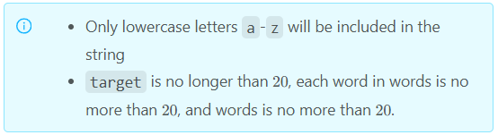

### 1456 · Word Synthesis Problem
Algorithms
Hard
Accepted Rate
43%


### Description
Given a target word targets and a collection of n words words, can you select some words from words and select one letter from each word to compose the target word target ?
### (i)
Only lowercase letters a-z will be included in the string
target is no longer than 
20
20, each word in words is no more than 
20
20, and words is no more than 
20
20.



## Example
```python
Given `target="ally"`，`words=["buy","discard","lip","yep"]`，return `false`
Input:
"ally"
["buy","discard","lip","yep"]
Output:
false

Explanation：
`buy` can match `y`, `discard` can match `a`, `lip` can match `l`, `yep` cannot correspond to any one letter, so there is still one `l` in `target` that cannot be matched. 

```
```python
Given `target="ray"`，`words=["buy","discard","lip","rep"]`，return `true`
Input:
"ray"
["buy","discard","lip","rep"]
Output:
true

Explanation：
`buy` can match `y`, `discard` can match `a`, `rep` can match `r`.

```
### SOLVE this:

```python
from typing import (
    List,
)

class Solution:
    """
    @param target: the target string
    @param words: words array
    @return: whether the target can be matched or not
    """
    def match_function(self, target: str, words: List[str]) -> bool:
        # Write your code here

```

### Tags
Graph
Depth First Search/DFS
Bipartite Graph

## Company
Amazon

### Related Problems


### best answer
1
```py
from collections import defaultdict, deque


class Solution:
    """
    @param target: the target string
    @param words: words array
    @return: whether the target can be matched or not
    """
    def matchFunction(self, target, words):
        # Write your code here
        graph = defaultdict(lambda: set())
        for word in words:
            for char in word:
                if not char in target:
                    continue
                graph[char].add(word)
        
        # bfs/dfs both accepted 
        # return self.hungarian_bfs(graph, target, words) == len(target)
        return self.hungarian_bfs(graph, target, words) == len(target)
    
    def hungarian_bfs(self, graph, target, words):
        '''bfs hungarian'''
        length, size = len(target), len(words)
        self.match = [None] * size
        self.used = [None] * size
        matched = 0
        prev = [0] * max(size, length)
        for i, char in enumerate(target):
            queue = deque([i])
            prev[i] = -1  # i is the source node
            flag = False  # flag: Found the augmentation path (zeng guang lu jing)
            while len(queue) > 0 and not flag:
                cur = queue.popleft()
                for j in range(size):
                    if not flag and words[j] in graph[target[cur]] and self.used[j] != i:
                        self.used[j] = i
                        if self.match[j] is not None:
                            queue.append(self.match[j])
                            prev[self.match[j]] = cur
                        else:
                            # found augumentation path
                            flag = True
                            d, e = cur, j
                            while (d != -1):  # XOR all the existing edges
                                self.match[e] = d
                                d = prev[d]
                            # print('match:', self.match)
                            # print('prev:', prev)
                            # print('deque', queue)
            if flag:
                matched += 1
        return matched
    
    def hungarian_dfs(self, graph, target, words):
        '''dfs hungarian'''
        size = len(words)
        self.match = [None] * size
        self.used = [False] * size
        matched = 0
        for i, char in enumerate(target):
            self.used = [False] * size
            # print(f"Start to match: {char}")
            # print(matched)
            matched += self.find(i, graph, target, words)
        return matched
    
    def find(self, x, graph, target, words):
        for i, word in enumerate(words):
            if word in graph[target[x]] and not self.used[i]:
                self.used[i] = True
                if self.match[i] is None or self.find(self.match[i], graph, target, words) == 1:
                    self.match[i] = x
                    # print(f"{target[x]} --> {word}")
                    return 1
        return 0
```
2
```py
class Solution:
    """
    @param target: the target string
    @param words: words array
    @return: whether the target can be matched or not
    """
    def matchFunction(self, target, words):
        # Write your code here

        # build mapping for bipartite
        # each char from target is left 
        # each word from words is right
        connection = self.build_connection(target, words)
        matched = {}
        max_match = 0
        self.connection = connection
        self.matched = matched

        # from each left char, search argumentign path
        for cidx, c in enumerate(target):
            node = ("char", cidx)
            if node in matched:
                continue
            if self.found_aug_path(node, set()):
                max_match += 1
                if max_match == len(target):
                    return True
        return max_match == len(target)

    def found_aug_path(self, node, visited):
        matched = self.matched
        connection = self.connection
        type, idx = node 
        for cnt in connection[node]:
            if cnt in visited:
                continue
            visited.add(cnt)
            if cnt not in matched or self.found_aug_path(matched[cnt], visited):
                matched[cnt] = node 
                matched[node] = cnt 
                return True
        return False

    def build_connection(self, target, words):
        connection = collections.defaultdict(set)
        for cidx, c in enumerate(target):
            for widx, w in enumerate(words):
                if c in w:
                    connection["char",cidx].add( ("word",widx) )
                    connection["word",widx].add( ("char",cidx) )
        return connection
```
3
```py
from typing import List
from functools import lru_cache
class Solution:
    def match_function(self, tar: str, words: List[str]) -> bool:
        words = [w for w in words if any(c in tar for c in w)]
        if len(words)<len(tar):
            return False
        score = [[int(c in w) for c in tar] for w in words]

        @lru_cache(None)
        def dfs(i, mask):
            if i==len(words):
                return bin(mask).count('1')==len(tar)
            return any(dfs(i+1, mask|(1<<j)) for j in range(len(tar)) if score[i][j] and not mask&(1<<j))

        return dfs(0, 0)
```


### Official answer from lintcode
//
1

这是一个二分图最大匹配问题
对于这道题，我们构造一个二分图，设二分图的两个点集为u和v。
对于target中的第i个字母s,如果words[j]中也有字母s，就将ui与vj连边。
然后跑一下匈牙利算法，如果最大匹配数恰好为target的长度，说明target的每个字符都被成功匹配了。
反之，如果最大匹配数小于target的长度，说明target中的部分字符没有被匹配到。
不过 事实上 这题为了降低难度，暴力搜索也可以过，C++代码是二分图匹配，java和python代码是暴力
```py
class Solution:
    """
    @param target: the target string
    @param words: words array
    @return: whether the target can be matched or not
    """
    def matchFunction(self, target, words):
        # Write your code here
        self.flag = 0
        self.vis = [0 for i in range(0, 21)]
        self.visit = [[-1] for i in range(0, 21)]
        self.l = len(target)
        a = len(target)
        for i in range(0, len(words)):
        	for j in range(0, len(words[i])):
        		for k in range(0, len(target)):
        			if (words[i][j] == target[k]):
        			    if (self.visit[k][0] == -1):
        			        self.visit[k][0] = i
        			    else:
        			        self.visit[k].append(i)
        self.dfs(0)
        if self.flag:
        	return True
        else:
        	return False
    def dfs(self, n):
    	if self.flag:
    		return
    	if n == self.l:
    		self.flag=  1
    		return
    	for i in range(0 , len(self.visit[n])):
    	    v = self.visit[n][i]
            if self.vis[v] == 0 and not v == -1:
				self.vis[v] = 1
				self.dfs(n + 1)
				self.vis[v] = 0
    	return
```


//2

解题思路
最小费用最大流 mcmf模板

题解代码
```py
from typing import (
    List,
)
from typing import NamedTuple, Optional, List, Tuple, cast
from heapq import heappush, heappop
from collections import *#defaultdict, Counter, deque
class MCFGraph:
    class Edge(NamedTuple):
        src: int
        dst: int
        cap: int
        flow: int
        cost: int

    class _Edge:
        def __init__(self, dst: int, cap: int, cost: int) -> None:
            self.dst = dst
            self.cap = cap
            self.cost = cost
            self.rev: Optional[MCFGraph._Edge] = None

    def __init__(self, n: int) -> None:
        self._n = n
        self._g: List[List[MCFGraph._Edge]] = [[] for _ in range(n)]
        self._edges: List[MCFGraph._Edge] = []

    def add_edge(self, src: int, dst: int, cap: int, cost: int) -> int:
        assert 0 <= src < self._n
        assert 0 <= dst < self._n
        assert 0 <= cap
        m = len(self._edges)
        e = MCFGraph._Edge(dst, cap, cost)
        re = MCFGraph._Edge(src, 0, -cost)
        e.rev = re
        re.rev = e
        self._g[src].append(e)
        self._g[dst].append(re)
        self._edges.append(e)
        return m

    def get_edge(self, i: int) -> Edge:
        assert 0 <= i < len(self._edges)
        e = self._edges[i]
        re = cast(MCFGraph._Edge, e.rev)
        return MCFGraph.Edge(re.dst, e.dst, e.cap + re.cap, re.cap, e.cost)

    def edges(self) -> List[Edge]:
        return [self.get_edge(i) for i in range(len(self._edges))]

    def flow(self, s: int, t: int,
             flow_limit: Optional[int] = None) -> Tuple[int, int]:
        return self.slope(s, t, flow_limit)[-1]

    def slope(self, s: int, t: int,
              flow_limit: Optional[int] = None) -> List[Tuple[int, int]]:
        assert 0 <= s < self._n
        assert 0 <= t < self._n
        assert s != t
        if flow_limit is None:
            flow_limit = cast(int, sum(e.cap for e in self._g[s]))

        dual = [0] * self._n
        prev: List[Optional[Tuple[int, MCFGraph._Edge]]] = [None] * self._n

        def refine_dual() -> bool:
            pq = [(0, s)]
            visited = [False] * self._n
            dist: List[Optional[int]] = [None] * self._n
            dist[s] = 0
            while pq:
                dist_v, v = heappop(pq)
                if visited[v]:
                    continue
                visited[v] = True
                if v == t:
                    break
                dual_v = dual[v]
                for e in self._g[v]:
                    w = e.dst
                    if visited[w] or e.cap == 0:
                        continue
                    reduced_cost = e.cost - dual[w] + dual_v
                    new_dist = dist_v + reduced_cost
                    dist_w = dist[w]
                    if dist_w is None or new_dist < dist_w:
                        dist[w] = new_dist
                        prev[w] = v, e
                        heappush(pq, (new_dist, w))
            else:
                return False
            dist_t = dist[t]
            for v in range(self._n):
                if visited[v]:
                    dual[v] -= cast(int, dist_t) - cast(int, dist[v])
            return True

        flow = 0
        cost = 0
        prev_cost_per_flow: Optional[int] = None
        result = [(flow, cost)]
        while flow < flow_limit:
            if not refine_dual():
                break
            f = flow_limit - flow
            v = t
            while prev[v] is not None:
                u, e = cast(Tuple[int, MCFGraph._Edge], prev[v])
                f = min(f, e.cap)
                v = u
            v = t
            while prev[v] is not None:
                u, e = cast(Tuple[int, MCFGraph._Edge], prev[v])
                e.cap -= f
                assert e.rev is not None
                e.rev.cap += f
                v = u
            c = -dual[s]
            flow += f
            cost += f * c
            if c == prev_cost_per_flow:
                result.pop()
            result.append((flow, cost))
            prev_cost_per_flow = c
        return result
class Solution:
    def match_function(self, target: str, words: List[str]) -> bool:
        d=defaultdict(list)
        for i,c in enumerate(target):#构建二分图
            for j,word in enumerate(words):
                if c in word:
                    d[i].append(j)

        m = len(target)
        n = len(words)
        maxval=10**9#基于dijkstra算法，权值不能为负数，本题用不到
        s = n + m#第一个超级原点
        t = s + 1#第二个超级原点
        e=t+1#第三个超级原点
        k=len(target)#限制边的数量
        g = MCFGraph(e + 1)
        
        for i,c in enumerate(target):
            g.add_edge(s, i, 1, 0)
            for j in d[i]:#j点和i点必须形成连续
                g.add_edge(i, m + j, 1, 1)#保证权值为正数,1为容量,用maxval去减适用于最大费用
        
        for j in range(n):
            g.add_edge(m + j, t, 1, 0)

        g.add_edge(t,e,k,0)#如果限制边数，构建k条边

        cnt, cost = g.flow(s,e) 
        return  cost==k#适用于最大费用，如果求最小费用即为cost，如果全部跑出来即为true

```