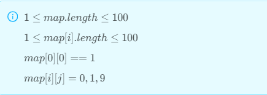

### 1479 · Can Reach The Endpoint
Algorithms
Easy
Accepted Rate
61%


### Description

Given a map size of m*n, 1 means space, 0 means obstacle, 9 means the endpoint. You start at (0,0) and return whether you can reach the endpoint.

## (i)
1≤map.length≤100
1
≤
m
a
p
[
i
]
.
l
e
n
g
t
h
≤
100
1≤map[i].length≤100
m
a
p
[
0
]
[
0
]
=
=
1
map[0][0]==1
m
a
p
[
i
]
[
j
]
=
0
,
1
,
9
map[i][j]=0,1,9




## Example
```python
Input: 
[
[1,1,1],
[1,1,1],
[1,1,9]
]
Output: true

```
```python
Input: 
[
[1,1,1],
[1,0,0],
[1,0,9]
]
Output: false

```
### SOLVE this:

```python
from typing import (
    List,
)

class Solution:
    """
    @param map: the map
    @return: can you reach the endpoint
    """
    def reach_endpoint(self, map: List[List[int]]) -> bool:
        # Write your code here

```

### Tags
Breadth First Search/BFS
## Company
Amazon

### Related Problems


### best answer
//
1
```py
from typing import (
    List,
)

class Solution:
    """
    @param map: the map
    @return: can you reach the endpoint
    """
    def reach_endpoint(self, map: List[List[int]]) -> bool:
        n = len(map)
        m = len(map[0])
        if n == 0 or m == 0 or map[0][0] == 0:
            return False
        dx = [0,1,0,-1]
        dy = [1,0,-1,0]
        vis = [[False for i in range(m)] for j in range(n)]
        q = collections.deque([0])
        while q:
            cur = q.popleft()
            curx = cur // m
            cury = cur % m
            for i in range(4):
                nx = curx + dx[i]
                ny = cury + dy[i]
                if nx < 0 or nx >= n or ny < 0 or ny >= m or vis[nx][ny] or map[nx][ny] == 0:
                    continue
                if map[nx][ny] == 9:
                    return True
                q.append(nx * m + ny)
                vis[nx][ny] = True
        return False
```
//
2
```py
class Solution:
    """
    @param map: the map
    @return: can you reach the endpoint
    """
    def reachEndpoint(self, map):
        # Write your code here
        if not map:
            return None
        
        queue = collections.deque([(0,0)])
        
        while queue:
            for _ in range(len(queue)):
                r, c = queue.popleft()
                if map[r][c] == 9:
                    return True
                if r+1 < len(map[0]) and map[r+1][c] != 0:
                    queue.append((r+1, c))
                if c+1 < len(map) and map[r][c+1] != 0:
                    queue.append((r, c+1))
        
        return False
```
//
3
```py
class Solution:
    def __init__(self):
        self.dx = [0, 1, 0, -1]
        self.dy = [1, 0, -1, 0]

    def reachEndpoint(self, map):
        if not map or not map[0]:
            return True

        rows, cols = len(map), len(map[0])

        return self.dfs(map, 0, 0, rows, cols, set())

    def dfs(self, map, x, y, rows, cols, visited):
        if not (0 <= x < rows and 0 <= y < cols) or map[x][y] == 0:
            return False

        if map[x][y] == 9:
            return True

        visited.add((x, y))

        for delta in range(4):
            next_x, next_y = x + self.dx[delta], y + self.dy[delta]
            
            if (next_x, next_y) in visited:
                continue

            reach = self.dfs(map, next_x, next_y, rows, cols, visited)

            if reach:
                return True

        return False
```


### Official answer from lintcode
bfs模板题
```py
from typing import (
    List,
)

class Solution:
    """
    @param map: the map
    @return: can you reach the endpoint
    """
    def reach_endpoint(self, map: List[List[int]]) -> bool:
        n = len(map)
        m = len(map[0])
        if n == 0 or m == 0 or map[0][0] == 0:
            return False
        dx = [0,1,0,-1]
        dy = [1,0,-1,0]
        vis = [[False for i in range(m)] for j in range(n)]
        q = collections.deque([0])
        while q:
            cur = q.popleft()
            curx = cur // m
            cury = cur % m
            for i in range(4):
                nx = curx + dx[i]
                ny = cury + dy[i]
                if nx < 0 or nx >= n or ny < 0 or ny >= m or vis[nx][ny] or map[nx][ny] == 0:
                    continue
                if map[nx][ny] == 9:
                    return True
                q.append(nx * m + ny)
                vis[nx][ny] = True
        return False
```
//2
就要 DFS！就要 DFS！就要 DFS！
```py
class Solution:
    def reachEndpoint(self, map):
        # Write your code here
        row, col = len(map), len(map[0])

        def dfs(x, y):
            if x < 0 or x >= row or y < 0 or y >= col or map[x][y] == 0:
                return False
            if map[x][y] == 9:
                return True
            map[x][y] = 0
            res = False
            res = res or dfs(x + 1, y)
            res = res or dfs(x - 1, y)
            res = res or dfs(x, y + 1)
            res = res or dfs(x, y - 1)
            map[x][y] = 1
            return res
        
        return dfs(0, 0)
```
//3
解题思路
this is easy solution. https://gta.sg

golden tuition academy.
find out more in the greatest tuition centre in singapore
free primary school worksheets from top schools in singapore

题解代码
```py
from typing import (
    List,
)

class Solution:
    """
    @param map: the map
    @return: can you reach the endpoint
    """
    def reach_endpoint(self, map: List[List[int]]) -> bool:
        # Write your code here 
        row, col = len(map), len(map[0])

        def dfs(x, y):
            if x < 0 or x >= row or y < 0 or y >= col or map[x][y] == 0:
                return False
            if map[x][y] == 9:
                return True
            map[x][y] = 0
            res = False
            res = res or dfs(x + 1, y)
            res = res or dfs(x - 1, y)
            res = res or dfs(x, y + 1)
            res = res or dfs(x, y - 1)
            map[x][y] = 1
            return res
        
        return dfs(0, 0)
```