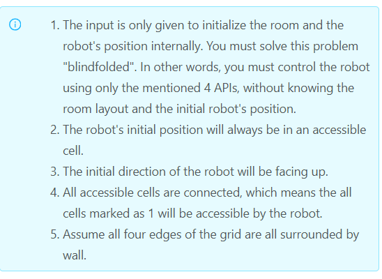

### 1514 · Robot Room Cleaner
Algorithms
Hard
Accepted Rate
76%


### Description
Given a robot cleaner in a room modeled as a grid.

Each cell in the grid can be empty or blocked.

The robot cleaner with 4 given APIs can move forward, turn left or turn right. Each turn it made is 90 degrees.

When it tries to move into a blocked cell, its bumper sensor detects the obstacle and it stays on the current cell.

Design an algorithm to clean the entire room using only the 4 given APIs shown below.

```py
interface Robot {
  // returns true if next cell is open and robot moves into the cell.
  // returns false if next cell is obstacle and robot stays on the current cell.
  boolean move();

  // Robot will stay on the same cell after calling turnLeft/turnRight.
  // Each turn will be 90 degrees.
  void turnLeft();
  void turnRight();

  // Clean the current cell.
  void clean();
}
```

## (i)
The input is only given to initialize the room and the robot's position internally. You must solve this problem "blindfolded". In other words, you must control the robot using only the mentioned 4 APIs, without knowing the room layout and the initial robot's position.
The robot's initial position will always be in an accessible cell.
The initial direction of the robot will be facing up.
All accessible cells are connected, which means the all cells marked as 1 will be accessible by the robot.
Assume all four edges of the grid are all surrounded by wall.




## Example
```python
Input：
room = [
  [1,1,1,1,1,0,1,1],
  [1,1,1,1,1,0,1,1],
  [1,0,1,1,1,1,1,1],
  [0,0,0,1,0,0,0,0],
  [1,1,1,1,1,1,1,1]
],
row = 1,
col = 3
Explanation：
All grids in the room are marked by either 0 or 1.
0 means the cell is blocked, while 1 means the cell is accessible.
The robot initially starts at the position of row=1, col=3.
From the top left corner, its position is one row below and three columns right.

```
```python
Input：
room = [
  [1,1,1,1,1,0,1,1],
  [1,1,1,1,1,0,1,1],
  [1,0,1,1,1,1,1,1],
  [1,0,0,1,0,0,0,1],
  [1,1,1,1,1,1,1,1]
],
row = 2,
col = 3
Explanation：
All grids in the room are marked by either 0 or 1.
0 means the cell is blocked, while 1 means the cell is accessible.
The robot initially starts at the position of row=2, col=3.
From the top left corner, its position is two rows below and three columns right.

```
### SOLVE this:

```python
# """
# This is the robot's control interface.
# You should not implement it, or speculate about its implementation
# """
#class Robot:
#    def move(self):
#        """
#        Returns true if the cell in front is open and robot moves into the cell.
#        Returns false if the cell in front is blocked and robot stays in the current cell.
#        :rtype bool
#        """
#
#    def turnLeft(self):
#        """
#        Robot will stay in the same cell after calling turnLeft/turnRight.
#        Each turn will be 90 degrees.
#        :rtype void
#        """
#
#    def turnRight(self):
#        """
#        Robot will stay in the same cell after calling turnLeft/turnRight.
#        Each turn will be 90 degrees.
#        :rtype void
#        """
#
#    def clean(self):
#        """
#        Clean the current cell.
#        :rtype void
#        """
class Solution:
    """
    :type robot: Robot
    :rtype: None
    """
    def cleanRoom(self, robot):
        #write your code here

```

### Tags
Depth First Search/DFS
## Company
Facebook
Amazon
Google
### Related Problems


### best answer
```py
# """
# This is the robot's control interface.
# You should not implement it, or speculate about its implementation
# """
#class Robot:
#    def move(self):
#        """
#        Returns true if the cell in front is open and robot moves into the cell.
#        Returns false if the cell in front is blocked and robot stays in the current cell.
#        :rtype bool
#        """
#
#    def turnLeft(self):
#        """
#        Robot will stay in the same cell after calling turnLeft/turnRight.
#        Each turn will be 90 degrees.
#        :rtype void
#        """
#
#    def turnRight(self):
#        """
#        Robot will stay in the same cell after calling turnLeft/turnRight.
#        Each turn will be 90 degrees.
#        :rtype void
#        """
#
#    def clean(self):
#        """
#        Clean the current cell.
#        :rtype void
#        """
class Solution:
    """
    :type robot: Robot
    :rtype: None
    """
    def cleanRoom(self, robot):
        #write your code here
        directions=[(0,-1),(-1,0),(0,1),(1,0)]


        def go_back():
            robot.turnLeft()
            robot.turnLeft()
            robot.move()
            robot.turnLeft()
            robot.turnLeft()
        visited=set()

        def dfs(x,y,d):

            if (x,y) in visited:
                return
            # if x < 0 or y < 0 :
            #     return 
            robot.clean()
            visited.add((x,y))
            # for direct in driections:
            for i in range(4):
                
                newd=(d+i)%4
                k,j=directions[newd]
                nx=x+k
                ny=y+j

                if robot.move():
                    dfs(nx,ny,newd)
                    go_back()
                robot.turnRight()
            


            return
        
        dfs(0,0,0)


```
```py
# """
# This is the robot's control interface.
# You should not implement it, or speculate about its implementation
# """
#class Robot:
#    def move(self):
#        """
#        Returns true if the cell in front is open and robot moves into the cell.
#        Returns false if the cell in front is blocked and robot stays in the current cell.
#        :rtype bool
#        """
#
#    def turnLeft(self):
#        """
#        Robot will stay in the same cell after calling turnLeft/turnRight.
#        Each turn will be 90 degrees.
#        :rtype void
#        """
#
#    def turnRight(self):
#        """
#        Robot will stay in the same cell after calling turnLeft/turnRight.
#        Each turn will be 90 degrees.
#        :rtype void
#        """
#
#    def clean(self):
#        """
#        Clean the current cell.
#        :rtype void
#        """
class Solution:
    """
    :type robot: Robot
    :rtype: None
    """
    def cleanRoom(self, robot):
        #write your code here
        directions = [(0, 1), (1, 0), (0, -1), (-1, 0)]
 
        def goBack(robot):
            robot.turnLeft()
            robot.turnLeft()
            robot.move()
            robot.turnRight()
            robot.turnRight()
 
        def dfs(pos, robot, d, lookup):
            if pos in lookup:
                return
            lookup.add(pos)
 
            robot.clean()
            for _ in directions:
                if robot.move():#go all the way till cannot move, then back one step
                    dfs((pos[0]+directions[d][0],
                         pos[1]+directions[d][1]),
                        robot, d, lookup)
                    goBack(robot) #trace back
                robot.turnRight() # or turnRight();
                d = (d+1) % len(directions)
         
        dfs((0, 0), robot, 0, set())
```
```py
# class Solution:
    
    
#     # dfs mark visited and then go to next level :
#     # dfs(x,y):
#     #     visited.add(x,y)
#     #     for nx ,ny in next(x,y):
#     #         dfs( nx, ny, robot, visited)
            
#     # mark (x,y) visited >> go next level dfs(nx, ny)
#     # def dfs( x, y, idx):
#     #     if idx == len(word):
#     #         return True
        
#     #     if not is_valid( x, y, idx):  is_valid: bdd, match the word, not visited
#     #         return False 
            
#     #     visited.add((x,y))
#     #     for nx, ny in next(x,y):
#     #         if dfs(nx, ny, idx+1): 
#     #             return True
#     #     visited.remove((x,y))
#     #     return False    
    
        
    
#     def cleanRoom(self, robot):

#         # backtracking
#         def goBack(robot):
#             robot.turnRight()
#             robot.turnRight()
#             robot.move()
#             robot.turnRight()
#             robot.turnRight()
 
#         next = lambda x,y: ((x-1,y),(x,y-1),(x+1,y),(x,y+1)) 
#         # is_valid = robot.move() bool 
        
#         def dfs( x, y, robot,  visited):
#             if (x,y) in visited:
#                 return
#             visited.add((x,y))
#             robot.clean()
#             for nx, ny in next(x,y):
#                 # robot.move() similar to graph is_valid(nx,ny)
#                 if robot.move():# go all the way till cannot move, then back one step
#                     dfs( nx, ny, robot, visited)
#                     goBack(robot) # backtracking
                
#         visited = set()
#         dfs( 0, 0, robot, visited)
        
        
class Solution:
    def cleanRoom(self, robot):
        """
        :type robot: Robot
        :rtype: None
        """
        directions = [(0, 1), (1, 0), (0, -1), (-1, 0)]
        # directions = zip([1,-1,0,0],[0,0,1,-1])
 
        def goBack(robot):
            robot.turnLeft()
            robot.turnLeft()
            robot.move()
            robot.turnRight()
            robot.turnRight()
 
        def dfs(pos, robot, d, lookup):
            if pos in lookup:
                return
            lookup.add(pos)
            robot.clean()
            for _ in directions:
                if robot.move():#go all the way till cannot move, then back one step
                    nx, ny = pos[0] + directions[d][0], pos[1] + directions[d][1]
                    dfs( (nx, ny), robot, d, lookup)
                    goBack(robot) #trace back
                robot.turnRight() # or turnRight();
                d = (d+1) % len(directions)
         
        dfs((0, 0), robot, 0, set())
```


### Official answer from lintcode
考点：

dfs
回溯
题解：
这是一道典型的DFS题目，我们可以让robot一直向前扫，直到obstructed。此时我们让robot换一个方向(turnLeft or turnRight)，然后继续move。直到robot到达一个点，这个点前后左右不是blocked就是visited的时候，返回。找到robot在这个点之前的状态，继续尝试换一个方向move。当所有的搜索返回，clean all the available point。
```py
# """
# This is the robot's control interface.
# You should not implement it, or speculate about its implementation
# """
#class Robot:
#    def move(self):
#        """
#        Returns true if the cell in front is open and robot moves into the cell.
#        Returns false if the cell in front is blocked and robot stays in the current cell.
#        :rtype bool
#        """
#
#    def turnLeft(self):
#        """
#        Robot will stay in the same cell after calling turnLeft/turnRight.
#        Each turn will be 90 degrees.
#        :rtype void
#        """
#
#    def turnRight(self):
#        """
#        Robot will stay in the same cell after calling turnLeft/turnRight.
#        Each turn will be 90 degrees.
#        :rtype void
#        """
#
#    def clean(self):
#        """
#        Clean the current cell.
#        :rtype void
#        """

class Solution:
    def cleanRoom(self, robot):
        """
        :type robot: Robot
        :rtype: None
        """
        directions = [(0, 1), (1, 0), (0, -1), (-1, 0)]
 
        def goBack(robot):
            robot.turnLeft()
            robot.turnLeft()
            robot.move()
            robot.turnRight()
            robot.turnRight()
 
        def dfs(pos, robot, d, lookup):
            if pos in lookup:
                return
            lookup.add(pos)
 
            robot.clean()
            for _ in directions:
                if robot.move():#go all the way till cannot move, then back one step
                    dfs((pos[0]+directions[d][0],
                         pos[1]+directions[d][1]),
                        robot, d, lookup)
                    goBack(robot) #trace back
                robot.turnRight() # or turnRight();
                d = (d+1) % len(directions)
         
        dfs((0, 0), robot, 0, set())
```

//2
DFS版
这个题目其实就是 看你对dfs的理解是否深刻了。 汤换了药没换。 这里的回溯不再是我们从results里面拿出去了， 而是真的让机器人去回头了。 但是整个代码还是很容易懂的。

```py
DIR_X = [-1, 0, 1, 0]
DIR_Y = [0, 1, 0, -1]
class Solution:
    """
    :type robot: Robot
    :rtype: None
    """
    def cleanRoom(self, robot):
        visited = set()
        self.dfs(robot, visited, (0, 0), 0)
    
    def dfs(self, robot, visited, pos, direction):
        if pos in visited:
            return
        visited.add(pos)
        robot.clean()

        cur_direction = direction
        for i in range(len(DIR_X)):
            if robot.move():
                new_pos = pos[0] + DIR_X[cur_direction % 4], pos[1] + DIR_Y[cur_direction % 4]
                self.dfs(robot, visited, new_pos, cur_direction)
                self.backtrack(robot)
            robot.turnRight()
            cur_direction += 1

    def backtrack(self, robot):
        robot.turnRight()
        robot.turnRight()
        robot.move()
        robot.turnRight()
        robot.turnRight()
```
//3
解题思路
题解代码
```py
# """
# This is the robot's control interface.
# You should not implement it, or speculate about its implementation
# """
#class Robot:
#    def move(self):
#        """
#        Returns true if the cell in front is open and robot moves into the cell.
#        Returns false if the cell in front is blocked and robot stays in the current cell.
#        :rtype bool
#        """
#
#    def turnLeft(self):
#        """
#        Robot will stay in the same cell after calling turnLeft/turnRight.
#        Each turn will be 90 degrees.
#        :rtype void
#        """
#
#    def turnRight(self):
#        """
#        Robot will stay in the same cell after calling turnLeft/turnRight.
#        Each turn will be 90 degrees.
#        :rtype void
#        """
#
#    def clean(self):
#        """
#        Clean the current cell.
#        :rtype void
#        """

class Solution:
    def cleanRoom(self, robot):
        """
        :type robot: Robot
        :rtype: None
        """
        directions = [(-1, 0), (0, 1), (1, 0), (0, -1)]
        visited = set()

        def go_back():
            robot.turnRight()
            robot.turnRight()
            robot.move()
            robot.turnRight()
            robot.turnRight()

        def dfs(x, y, direction):
            visited.add((x, y))
            robot.clean()

            for i in range(4):
                d = (direction + i) % 4
                new_x = x + directions[d][0]
                new_y = y + directions[d][1]
                if (new_x, new_y) not in visited and robot.move():
                    dfs(new_x, new_y, d)
                    go_back()

                robot.turnRight()

        dfs(0, 0, 0)
```