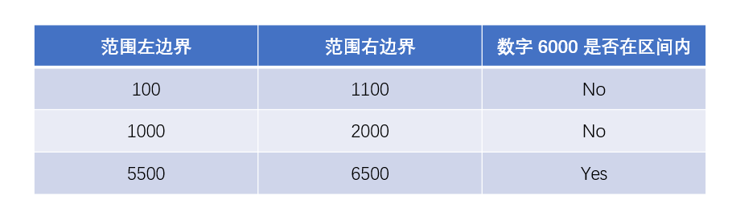

### 1564 · Interval Search
Algorithms
Easy
Accepted Rate


### Description
Given a List of intervals, the length of each interval is 1000, such as [500,1500], [2100,3100].Give a number arbitrarily and determine if the number belongs to any of the intervals.return True or False.


## Example
```python
Input: List = [[100,1100],[1000,2000],[5500,6500]] and number = 6000
Output: true
Explanation: 
6000 is in [5500,6500]

```
```python
Input: List = [[100,1100],[2000,3000]] and number = 3500
Output: false
Explanation: 
3500 is not in any list's interval 

```
### SOLVE this:

```python
from typing import (
    List,
)

class Solution:
    """
    @param interval_list: 
    @param number: 
    @return: return True or False
    """
    def is_interval(self, interval_list: List[List[int]], number: int) -> str:
        # Write your code here

```

### Tags
Enumerate
## Company
Amazon

### Related Problems


### best answer
```py
from typing import (
    List,
)

class Solution:
    """
    @param interval_list: 
    @param number: 
    @return: return True or False
    """
    def is_interval(self, interval_list: List[List[int]], number: int) -> str:
        # 遍历输入的区间
        for vec in interval_list:
            # 判断 number 是否在当前区间中，如果是，直接返回 "True"
            if number >= vec[0] and number <= vec[1]:
                return "True"
        # number 不在输入的任何一个区间内，返回 "False"
        return "False"
```
```py
class Solution:
    """
    @param intervalList: 
    @param number: 
    @return: return True or False
    """
    def isInterval(self, intervalList, number):
        # Write your code here
        for interval in intervalList:
            if interval[0] <= number <= interval[1]:
                return "True"
        return "False"
```
```py
class Solution:
    """
    @param intervalList: 
    @param number: 
    @return: return True or False
    """
    def isInterval(self, intervalList, number):
        # Write your code here
        for interval in intervalList:
            if number<=interval[1] and number>=interval[0]:
                return 'True'
        return 'False'
    # def isInterval(self, intervals, target) -> str:
        
    #     for left, right in intervals:
    #         if left <= target <= right:
    #             return 'True'
                
    #     return 'False'
```


### Official answer from lintcode
枚举list中所有的区间，看number是否在里面就行
```py
class Solution:
    """
    @param intervalList: 
    @param number: 
    @return: return True or False
    """
    def isInterval(self, intervalList, number):
        # Write your code here
        for interval in intervalList :
            if(number >= interval[0] and number <= interval[1]):
                return "True"
        return "False"
```
//2
解题思路
本题知识点：枚举。

枚举
在数学和计算机科学理论中，一个集的枚举是列出某些有穷序列集的所有成员的程序，或者是一种特定类型对象的计数。

枚举算法指的是对有穷的集合中的所有元素列举出来。

解题方法：

枚举输入的范围数组，判断给出的数字是否在当前的范围中。
若遍历过程中找到了一个范围包含输入的数字，直接返回 "True"。
若遍历完毕后没有找到任何一个范围包含输入的数字，则返回 "False"。
样例的遍历过程如下图：

数字 6000 出现在最后一个区间中，所以最后返回 "True"。

复杂度分析
空间复杂度： 
O
(
1
)
O(1)，仅需额外常数个变量。
时间复杂度： 
O
(
N
)
O(N)，
N
N 为输入数组长度。范围数组的每个范围仅需校验一次。

题解代码
```py
from typing import (
    List,
)

class Solution:
    """
    @param interval_list: 
    @param number: 
    @return: return True or False
    """
    def is_interval(self, interval_list: List[List[int]], number: int) -> str:
        # 遍历输入的区间
        for vec in interval_list:
            # 判断 number 是否在当前区间中，如果是，直接返回 "True"
            if number >= vec[0] and number <= vec[1]:
                return "True"
        # number 不在输入的任何一个区间内，返回 "False"
        return "False"
```