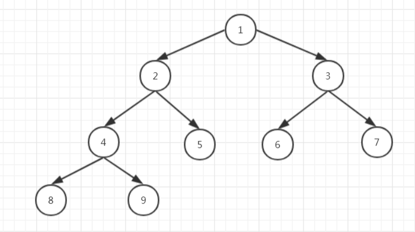

### 1566 · Minimum Difference
Algorithms
Hard
Accepted Rate
56%


### Description
Given a 2D array size of n * m and the elements of each row of the array are sorted. Select 1 number from each row and select n numbers in total. And the diff of n numbers is maximum-minimum, find the minimum diff.

## (i)

0≤n∗m≤1e6


## Example
```python
Input: [[1,2,3,4,5],[6,7,8,9,10]]
Output: 1
Explanation:
In the first line, select element 5
In the second line, select element 6
Their diff is 1

```
```python
Input: [[1,2,3,46,65],[3,5,10,46,54]]
Output: 0
Explanation:
In the first line, select element 46
In the second line, select element 46
Their diff is 0

```
### SOLVE this:

```python
from typing import (
    List,
)

class Solution:
    """
    @param array: a 2D array
    @return: the minimum difference
    """
    def minimum_difference(self, array: List[List[int]]) -> int:
        # Write your code here

```

### Tags
Heap
## Company
Amazon

### Related Problems


### best answer
```py
class Solution:
    """
    @param array: a 2D array
    @return: the minimum difference
    """
    def minimumDifference(self, m):
        # Write your code here
        rows = len(m)
        A = []

        for r, row in enumerate(m):
            A += [(val, r) for val in row]
        
        A.sort()

        window = [0 for _ in range(rows)]

        window_count = 0
        start = 0
        ans = math.inf

        for end in range(len(A)):
            current_val, current_row = A[end]
            if window[current_row] == 0:
                window_count += 1
            window[current_row] += 1

            while window_count == rows:
                #print(window, A[start: end + 1])
                start_val, start_row = A[start]
                ans = min(ans, current_val - start_val)
                #print(ans)
                window[start_row] -= 1
                if window[start_row] == 0:
                    window_count -= 1
                start += 1
        
        return ans
```
```py
# 本题解信息来源于【九章算法】。请勿进行商业转载，非商业转载请注明出处。
class Solution:
    """
    @param array: a 2D array
    @return: the minimum difference
    """
    def minimumDifference(self, array):
        # Write your code here
        
        import heapq
        rows, cols = len(array), len(array[0])
        minDiff = sys.maxsize
        heap = [(array[i][0], i, 0) for i in range(rows)]
        heapq.heapify(heap)
        maxValue = max([array[i][0] for i in range(rows)])
        
        while heap:
            
            val, i, j = heapq.heappop(heap)
            minDiff = min(maxValue - val, minDiff) # update minDiff
            
            # if this node is the last num in this row, break while loop
            if j == cols - 1:
                break
                
            maxValue = max(maxValue, array[i][j + 1]) # update maxValue
            heapq.heappush(heap, (array[i][j + 1], i, j + 1))
            
        return minDiff
```
```py
from typing import (
    List,
)

import heapq

# class Node(object):
#     def __init__(self, val: int, row: int, col: int):
#         self.val = val
#         self.row = row
#         self.col = col

#     def __lt__(self, other):
#         return self.val < other.val

class Solution:
    """
    @param array: a 2D array
    @return: the minimum difference
    """
    def minimum_difference(self, array: List[List[int]]) -> int:
        # Write your code here
        if not array or not array[0] or len(array) < 2:
            return 0
        
        queue = []
        heapq.heapify(queue)
        m, n = len(array), len(array[0])

        max_val = float('-inf')
        min_diff = float('inf')
        for i in range(m):
            heapq.heappush(queue, (array[i][0], i, 0))
            max_val = max(max_val, array[i][0])
        
        while queue:
            smallest, row, col = heapq.heappop(queue)
            min_diff = min(min_diff, max_val - smallest)

            if col + 1 == n:
                break
            
            max_val = max(max_val, array[row][col + 1])
            heapq.heappush(queue, (array[row][col + 1], row, col + 1))
        
        return min_diff
```


### Official answer from lintcode
用minHeap。将每行的第一个元素拿出来建最小堆。
看最小堆的元素是从哪一行来的，则pop top()， 并将该行的下一个元素进堆。
注意这时候要更新minHeap的最大值和minDiff。
注意，这个minDiff要用绝对值。
当某一行的元素走到头之后，就可退出循环，返回minDiff即可。
```py
class Solution:
    """
    @param array: a 2D array
    @return: the minimum difference
    """
    def minimumDifference(self, array):
        # Write your code here
        
        import heapq
        rows, cols = len(array), len(array[0])
        minDiff = sys.maxsize
        heap = [(array[i][0], i, 0) for i in range(rows)]
        heapq.heapify(heap)
        maxValue = max([array[i][0] for i in range(rows)])
        
        while heap:
            
            val, i, j = heapq.heappop(heap)
            minDiff = min(maxValue - val, minDiff) # update minDiff
            
            # if this node is the last num in this row, break while loop
            if j == cols - 1:
                break
                
            maxValue = max(maxValue, array[i][j + 1]) # update maxValue
            heapq.heappush(heap, (array[i][j + 1], i, j + 1))
            
        return minDiff
```
//2
解题思路
本题知识点：最小堆。

堆
堆是一种经过排序的完全二叉树，其中任一非终端节点的数据值均不大于（或不小于）其左子节点和右子节点的值。
最大堆和最小堆是二叉堆的两种形式。

最大堆：根结点的键值是所有堆结点键值中最大者。
最小堆：根结点的键值是所有堆结点键值中最小者。

堆的插入元素和移除堆顶元素的操作的时间复杂度都为 
O
(
l
o
g
N
)
O(logN)。

下图是一个最小堆：


解题方法：

先将每行的第一个元素放入最小堆中。并持续维护堆中的最大值。
持续迭代，每次取出堆顶元素，计算和最大值的差 maxDiff。并在堆中放入所取出元素所在行的下一个数字。
直到取的某个元素为一行的最后一个元素，退出迭代。
最后返回 maxDiff 即为结果。
具体请见下面题解代码一节。

复杂度分析
N
N 为输入数组的行数，
M
M 为输入数组的列数。
空间复杂度： 
O
(
N
)
O(N)，需要一个大小为 
N
N 的最小堆和存储每行已经取出下标的数组。
时间复杂度： 
O
(
N
⋅
M
⋅
l
o
g
N
)
O(N⋅M⋅logN)，对输入数组进行遍历，每次遍历操作最小堆的时间为 
O
(
l
o
g
N
)
O(logN)。

题解代码
```py
import heapq
from typing import (
    List,
)

class Solution:
    """
    @param array: a 2D array
    @return: the minimum difference
    """
    def minimum_difference(self, array: List[List[int]]) -> int:
        # 最小堆， 堆元素为 值-行号 的元素对
        min_heap = []
        # 堆中最大值
        max_val = -1
        # 将每行第一个数字放入最小堆
        for i in range(len(array)):
            min_heap.append([array[i][0], i])
            max_val = max(max_val, array[i][0])
        
        heapq.heapify(min_heap)
        
        # 记录已经拿到的每行的元素下标
        arr_idx = [0] * len(array)

        # 最终结果
        min_diff = 2000000
        # 迭代计算 最小 diff
        while True:
            # 获取最小堆的堆顶元素
            val = heapq.heappop(min_heap)
            # 计算 diff
            min_diff = min(min_diff, abs(val[0] - max_val))
            # 行号
            row = val[1]
            # 某行拿完，则跳出
            arr_idx[row] += 1
            if arr_idx[row] >= len(array[row]):
                break
            
            # 最小堆插入新值
            new_val = array[row][arr_idx[row]]
            max_val = max(max_val, new_val)
            heapq.heappush(min_heap, [new_val, row])
        # 返回结果
        return min_diff

```
//3
解题思路
染色法+滑动窗口
给每一行元素染色，全部颜色集齐就可以左滑窗口
```py
from typing import (
    List,
)
from collections import *#defaultdict, Counter, deque
class Solution:
    def minimum_difference(self, array: List[List[int]]) -> int:
        d=defaultdict(list)
        n=len(array)
        for i,a in enumerate(array):
            for num in a:
                d[num].append(i)
        res=sorted(d.keys())
        arr=[0]*n
        tmp=0
        ans=1<<31
        j=0
        for i in range(len(res)):
            k=res[i]
            for m in d[k]:
                if arr[m]==0:
                    tmp+=1
                arr[m]+=1
            while tmp==n:
                k=res[j]
                for m in d[k]:
                    if arr[m]==1:
                        tmp-=1
                    arr[m]-=1
                ans=min(ans,res[i]-res[j])
                j+=1
        return ans
```