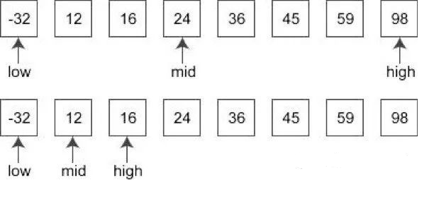

### 1636 · Aerial Movie
Algorithms
Medium
Accepted Rate
48%


### Description
In order to prevent passengers from being too bored during the flight, LQ Airlines decided to play two movies during the flight. Since the movie cannot be played during the take-off and landing of the aircraft, LQ Airlines must ensure that the duration of the two movies to be less than or equal to the flight duration minus 30 minutes, and the total length of the two movies should be as long as possible. Now given t ,the flight duration(minutes), and array dur[],the length of movies. Please output the length of the two movies in order of length. If there are multiple groups of the same length, select the one which contains the longest single moive.It is guarantee that there is a least one solution.

## (i)
30<t<=1000
dur[i]<=1000
1<=len(dur)<=100000


## Example
```python
Input：t=87，dur=[20,25,19,37]
Output：[20,37]
Explanation:
87-30=57
20+25=45,57-45=12
20+19=39,57-39=19
20+37=57,57-57=0
25+19=44,57-44=13
25+37=62,57<62
19+37=56,57-56=1

```
```python
Input：t=67，dur=[20,17,19,18]
Output：[17,20]
Explanation:
67-30=37
17+20=37,18+19=37
The longest movie in the first group is 20，and 19 in the second grouo, so output`[17,20]`

```
### SOLVE this:

```python
from typing import (
    List,
)

class Solution:
    """
    @param t: the length of the flight
    @param dur: the length of movies 
    @return: output the lengths of two movies
    """
    def aerial_movie(self, t: int, dur: List[int]) -> List[int]:
        # Write your code here

```

### Tags
Binary Search
## Company
Amazon

### Related Problems


### best answer
```py
from typing import (
    List,
)

class Solution:
    """
    @param t: the length of the flight
    @param dur: the length of movies 
    @return: output the lengths of two movies
    """
    def aerial_movie(self, t: int, dur: List[int]) -> List[int]:
        # Write your code here
        dur = sorted(dur)
        target = t - 30
        left, right = 0, len(dur) - 1
        m, mleft, mright = 0, 0, 0
        while left < right:
            sum = dur[left] + dur[right]
            if sum <= target:
                if sum > m:
                    m = sum
                    mleft = left
                    mright = right
                left += 1
            else:
                right -= 1 
        return [dur[mleft], dur[mright]]
```
//2
```py
from typing import (
    List,
)

import bisect

class Solution:
    """
    @param t: the length of the flight
    @param dur: the length of movies 
    @return: output the lengths of two movies
    """
    def aerial_movie(self, t: int, dur: List[int]) -> List[int]:
        # Write your code here
        dur.sort()
        targetSum = t - 30

        minDelta = float('inf')
        bestPair = []

        longerDuration = targetSum - dur[0]
        right = bisect.bisect_right(dur, longerDuration)

        if not right: return []
        left, right = 0, right - 1

        while left < right:
            shorterDuration = targetSum - dur[right]
            left = bisect.bisect_left(dur, shorterDuration)
            if left > right:
                left = right
            if dur[left] != shorterDuration or left == right:
                left -= 1
            
            delta = targetSum - dur[left] - dur[right]
            if delta < minDelta:
                if delta == 0:
                    return [dur[left], dur[right]]
                minDelta = delta
                bestPair = [dur[left], dur[right]]
            right -= 1
        return bestPair
```
//3

```py
# TinLittle
# 发布于 2020-06-09
# python
# 上传时Lintcod里Python最优解。

# 要素是用二分法先找到可允许的最长电影，然后用它做为 Anchor 一边递降一边用二分法找最长的短电影。

# 这题面试时在白板上写，很是考验以下编程能力和习惯：
# 1. 二分法的实际应用
# 2. 双指针
# 3. 测试和测试数据覆盖
# 4. 程序初试质量

# 基本上，这题能一次通过，编程质量可以认为是过关了。此题解值得多打并熟记。

# 如果你有写的更易懂，务请告知指正。

import bisect

class Solution:
    """
    @param t: the length of the flight
    @param dur: the length of movies 
    @return: output the lengths of two movies
    """
    def aerialMovie(self, t, dur):
        dur.sort()
        targetSum = t - 30
        
        minDelta = sys.maxsize
        bestPair = []
        
        # 先找到可取的最大数，这是由最小数的值决定的
        longerDuration = targetSum - dur[0]
        right = bisect.bisect_right(dur, longerDuration)
        if not right:
            return []
        left, right = 0, right - 1 
            
        while left < right:
            
            shorterDuration = targetSum - dur[right]
            left = bisect.bisect_left(dur, shorterDuration)
            if left > right:
                left = right
            if dur[left] != shorterDuration or left == right:
                left -= 1 
            
            delta = targetSum - dur[left] - dur[right]
            if delta < minDelta:
                if delta == 0:
                    return [dur[left], dur[right]]
                minDelta = delta 
                bestPair = [dur[left], dur[right]]
            
            right -= 1 
                
        return bestPair
```
//4
```py
from typing import (
    List,
)

class Solution:
    """
    @param t: the length of the flight
    @param dur: the length of movies 
    @return: output the lengths of two movies
    """
    def aerial_movie(self, t: int, dur: List[int]) -> List[int]:
        # Write your code here
        target = t - 30 
        dur.sort()
        n = len(dur)
        min_diff = float('inf')
        start, end = 0, n-1
        res = [-1, -1]
        while start < end:
            total = dur[start] + dur[end]
            if total == target:
                return [dur[start], dur[end]]
            elif total < target:
                if target - total < min_diff:
                    min_diff = target - total
                    res = [dur[start], dur[end]]
                start += 1
            else:
                end -= 1
        return res
```


### Official answer from lintcode
解题思路
本题知识点：二分查找。

二分查找
二分查找也称折半查找（Binary Search），它是一种效率较高的查找方法。但是，折半查找要求线性表必须采用顺序存储结构，而且表中元素按关键字有序排列。

首先，假设表中元素是按升序排列，将表中间位置记录的关键字与查找关键字比较，如果两者相等，则查找成功；否则利用中间位置记录将表分成前、后两个子表，如果中间位置记录的关键字大于查找关键字，则进一步查找前一子表，否则进一步查找后一子表。重复以上过程，直到找到满足条件的记录，使查找成功，或直到子表不存在为止，此时查找不成功。

二分查找的时间复杂度为 
O
(
l
o
g
n
)
O(logn) 。

二分查找可以用于找到数组中第一个大于目标值的元素的下标。这个过程一般被称为 upper_bound , 代码为：
```py
def upper_bound(self, nums: List[int], l: int, r: int, v: int) -> int:
    if v >= nums[r]:
        return r + 1
    while l < r:
        m = (l + r) >> 1
        if nums[m] <= v:
            l = m + 1
        else:
            r = m
    return l
```
解题方法：

先对 dur 数组从小到大快速排序。
遍历排序后数组的每个元素 x，那么我们需要找的是这个元素后续元素中，是否有一个元素 y 满足 t - x - 30 的元素。如果有，我们选择最大的一个。 没有则继续尝试。 注意 x 的下标要和 y 的下标不同。
可以通过 upper_bound 二分查找来找到 x 后续子数组中大于 t - x - 30 的元素下标，减去 1 之后即可得到 y 的下标。
得到了有效的 x 和 y 的配对之后，按照题意更新最终结果。 最终返回即可。

复杂度分析
空间复杂度： 
O
(
1
)
O(1)。仅需额外的常数个变量。
时间复杂度： 
O
(
N
l
o
g
N
)
O(NlogN)。快速排序时间复杂度 
O
(
N
l
o
g
N
)
O(NlogN)。对每个元素的后续元素进行二分查找，复杂度 
O
(
N
l
o
g
N
)
O(NlogN)。故总时间复杂度 
O
(
N
l
o
g
N
)
O(NlogN)。

题解代码:

```py
from typing import (
    List,
)

class Solution:
    # 二分查找数组中第一个大于 v 的元素的下标
    def upper_bound(self, nums: List[int], l: int, r: int, v: int) -> int:
        if v >= nums[r]:
            return r + 1
        while l < r:
            m = (l + r) >> 1
            if nums[m] <= v:
                l = m + 1
            else:
                r = m
        return l
    
    """
    @param t: the length of the flight
    @param dur: the length of movies 
    @return: output the lengths of two movies
    """
    def aerial_movie(self, t: int, dur: List[int]) -> List[int]:
        # 对 dur 数组进行排序
        dur.sort()
        # 结果数组
        res = [0, 0]
        # 对排序后的 dur 数组中的每个元素进行遍历
        for i in range(len(dur) - 1):
            # 二分查找后续元素中能够满足题意的元素。
            j = self.upper_bound(dur, i + 1, len(dur) - 1, t - 30 - dur[i]) - 1;
            # 如果找不到，则跳过。
            num_sum = dur[i] + dur[j]
            if num_sum > t - 30:
                continue
            if j <= i:
                continue
            # 更新结果数组。
            if num_sum > res[0] + res[1] or (num_sum == res[0] + res[1] and dur[j] > res[1]):
                res[0] = dur[i];
                res[1] = dur[j];

        # 返回最终结果。
        return res
```

//2
考点：

二分查找
题解：
数组dur排序后，从后向前每次假定选择当前电影，二分查找前面最合适的电影长度，暂时保存结果，每次判断更新即可。

涉及到有序数组中不大于某数的最大数查找
```py
class Solution:
    """
    @param t: the length of the flight
    @param dur: the length of movies 
    @return: output the lengths of two movies
    """
    def find(self, dur, need, pos) :
        l = 0
        r = pos
        while l <= r :
            mid = (l + r) >> 1
            if dur[mid] <= need :
                l = mid + 1
            else :
                r = mid - 1
        if r == -1 :
            return dur[0]
        return dur[r]
    def aerial_Movie(self, t, dur):
        t -= 30
        ans = 0
        res = []
        dur.sort()
        for  i in range(len(dur) - 1, -1 , -1 ):
             if dur[i] < t :
                 tmp = self.find(dur, t - dur[i], i - 1)
                 if tmp <= t - dur[i] and tmp + dur[i] > ans :
                     ans = tmp + dur[i]
                     if len(res) > 0:
                        res.pop()
                        res.pop()
                     res.append(tmp)
                     res.append(dur[i])
        return res
```