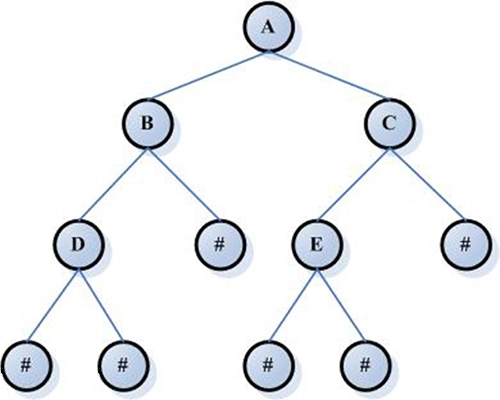

### 1637 · Tree problem
Algorithms
Medium
Accepted Rate
44%


### Description
Given a tree of n nodes. The ith node's father is fa[i-1] and the value of the ith node is val[i-1]. Especially, 1 represents the root, 2 represents the second node and so on. We gurantee that -1 is the father of root(the first node) which means that fa[0] = -1.
The average value of a subtree is the result of the sum of all nodes in the subtree divide by the number of nodes in it.
Find the maximum average value of the subtrees in the given tree, return the number which represents the root of the subtree.

## (i)
the number of nodes do not exceed 100000
If there are more than one subtree meeting the requirement, return the minimum number.


## Example
```python
Input：fa=[-1,1,1,2,2,2,3,3]，val=[100,120,80,40,50,60,50,70]
Output：1
Explanation：
                      -1  ------No.1
                    /     \
         No.2 ----1        1---------No.3
               /  |  \     /  \
              2   2   2    3   3

              
              
The result of No.1 node is (100+120+80+40+50+60+50+70) / 8 = 71.25
The result of No.2 node is (120 + 40 + 50 + 60) / 4 = 67.5
The result of No.3 node(80+50+70) / 3 = 66.6667
So return 1.

```
```python
Input：fa=[-1,1]，val=[30,40]
Output：2
Explanation：
The result of No.1 node is (30+40)/2=35
The result of No.2 node is 40/1=40
return 2

```
### SOLVE this:

```python
from typing import (
    List,
)

class Solution:
    """
    @param fa: the father
    @param val: the val
    @return: the biggest node
    """
    def tree_problem(self, fa: List[int], val: List[int]) -> int:
        # Write your code here

```

### Tags
Depth First Search/DFS
Tree
## Company
Amazon

### Related Problems


### best answer
```py
from typing import (
    List,
)

class Solution:
    """
    @param fa: the father
    @param val: the val
    @return: the biggest node
    """
    def tree_problem(self, fa: List[int], val: List[int]) -> int:
        from collections import defaultdict
        n = len(val)
        children = defaultdict(list)
        
        # Build tree from the father array
        for i in range(1, n):
            parent = fa[i]
            children[parent].append(i + 1)
        
        print(children)

        # Prepare to store sums and sizes of subtrees
        subtree_sum = [0] * (n + 1)
        subtree_size = [0] * (n + 1)
        
        def dfs(node):
            # Initialize current node sum and size
            subtree_sum[node] = val[node - 1]
            subtree_size[node] = 1
            
            # Process all children
            for child in children[node]:
                dfs(child)
                subtree_sum[node] += subtree_sum[child]
                subtree_size[node] += subtree_size[child]
        
        # Start DFS from the root, which is node 1
        dfs(1)
        
        print(subtree_sum)
        print(subtree_size)

        # Find the maximum average
        max_average = float('-inf')
        max_node = 1
        
        for node in range(1, n + 1):
            if subtree_size[node] > 0:
                average = subtree_sum[node] / subtree_size[node]
                if average > max_average:
                    max_average = average
                    max_node = node
        
        return max_node
```
//2
```py
from typing import (
    List,
)
import collections 
class Solution:
    """
    @param fa: the father
    @param val: the val
    @return: the biggest node
    """
    def tree_problem(self, fa: List[int], val: List[int]) -> int:
        ### 1) parent->child using dfs  2) child->parent using topo sort 
        ### tree can always use topo sort, start from leaves, bc leaves indegree = 0 
        ### note tree topo sort indegree dir is from child->parent
        n = len(fa)
        in_degree = collections.defaultdict(int)
        cnt = [1] * n 
        ### calc indegree
        for child in range(1, n):
            father = fa[child] - 1
            in_degree[father] += 1
        
        ### append all 0 inderee 
        q = collections.deque([])
        for node in range(1, n):
            if in_degree[node] == 0:
                q.append(node) 
        
        while q:
            pop = q.popleft()
            father = fa[pop] - 1
            if father > -1:  ### if pop is not root 
                ### child done, need: add val & cnt to parent, then del 1 indegree to parent
                cnt[father] += cnt[pop]
                val[father] += val[pop]
                in_degree[father] -= 1
                if in_degree[father] == 0:
                    q.append(father)
        
        mx, res = -float('inf'), 0
        for i in range(n):
            if val[i]/cnt[i] > mx:
                mx, res = val[i]/cnt[i], i 
            elif val[i]/cnt[i] == mx:
                res = min(res, i)
        return res+1
```
//3
```py
from typing import (
    List,
)

class Solution:
    """
    @param fa: the father
    @param val: the val
    @return: the biggest node
    """
    def tree_problem(self, fa: List[int], val: List[int]) -> int:
        # Write your code here
        _, seq = zip(*sorted(zip(fa,range(len(fa))), key = lambda x:-x[0]))
        
        # seq is the sequence of index ranked by parent in reversed order
        memo = [[v, 1] for v in val] # current sum and count
		
        # add subtree value and count to subtree root
        for i in seq:
            if fa[i] == -1: continue
            parent = fa[i] - 1
            memo[parent][0] += memo[i][0]
            memo[parent][1] += memo[i][1]
        
        # loop the memo to find max avg
        maxavg = -float("inf")
        res = 0
        for i, tmp in enumerate(memo):
            curavg = tmp[0] / tmp[1]
            if curavg > maxavg:
                maxavg = curavg
                res = i
        
        # remember to add 1 
        return res + 1
```
//4
```py
from typing import (
    List,
)

from collections import defaultdict
class Solution:
    """
    @param fa: the father
    @param val: the val
    @return: the biggest node
    """
    def tree_problem(self, fa: List[int], val: List[int]) -> int:
        # Write your code here

        tree = defaultdict(list)
        for i in range(len(fa)):
            if fa[i] != -1:
                tree[fa[i]].append(i + 1)

        res = [0]
        traverse(tree, 1, val, [0], res)
        return res[0]

def traverse(tree, cur, val, best_average, res):
    if not cur:
        return 0, 0

    best_sum, best_count = val[cur - 1], 1
    for child in tree[cur]:
        sum, count = traverse(tree, child, val, best_average, res)

        best_sum += sum
        best_count += count

    if best_sum / best_count > best_average[0]:
        best_average[0] = best_sum / best_count
        res[0] = cur

    return best_sum, best_count
```


### Official answer from lintcode
解题思路
本题知识点：树。

树


树是一种数据结构，它是由 
n
(
n
≥
0
)
n(n≥0) 个有限节点组成一个具有层次关系的集合。把它叫做“树”是因为它看起来像一棵倒挂的树，也就是说它是根朝上，而叶朝下的。它具有以下的特点：

每个节点有零个或多个子节点。
没有父节点的节点称为根节点。
每一个非根节点有且只有一个父节点。
除了根节点外，每个子节点可以分为多个不相交的子树。
树的性质：

树的任意两个节点之间有且只有唯一的路径。
树的节点数等于数的边数加 1： 
E
=
V
+
1
E=V+1 。
本题中，树的父节点和节点值都是用数组表示的。

解题方法：

新增两个数组，分别记录以当前节点为根的子树的节点数 node_cnt 和以当前节点为根的子树的节点和数组 node_sum。
遍历每个节点，更新从此节点往树根的路径上所有节点的 node_cnt 和 node_sum 数组的值。这样两个数组的值都会构造好。
遍历每个节点的 node_cnt 和 node_sum 值，计算子树的平均价值。根据题意更新最终结果。
返回最终结果的节点标记即可。
复杂度分析
空间复杂度： 
O
(
N
)
O(N)。需要两个额外的长度为 
N
N 的整型的数组。
时间复杂度： 
O
(
N
l
o
g
N
)
O(NlogN)。对每个节点，需要更新本节点到根的路径上的所有点 (时间复杂度 
O
(
l
o
g
N
)
O(logN))，所以总体时间复杂度为 
O
(
N
l
o
g
N
)
O(NlogN)。

题解代码
```py
from typing import (
    List,
)

class Solution:
    # float 类型比较
    def cmp_float(self, a: float, b: float) -> int:
        eps = 1e-8
        if abs(a - b) < eps:
            return 0
        if a < b:
             return -1
        return 1

    """
    @param fa: the father
    @param val: the val
    @return: the biggest node
    """
    def tree_problem(self, fa: List[int], val: List[int]) -> int:
        # 记录当前节点为根的子树的节点数和节点和的数组。
        node_cnt = [0] * len(fa)
        node_sum = [0] * len(fa)
        # 构造 node_cnt 和 node_sum 两个数组的值。
        for i in range(len(fa)):
            idx = i
            # 如果当前节点有父亲，则将本节点的值加到父亲的 node_sum 数组中，且将父亲的 node_cnt 增加 1。
            while idx >= 0:
                node_cnt[idx] += 1
                node_sum[idx] += val[i]
                idx = fa[idx]
                if idx > 0:
                    idx -= 1
    
        max_avg_value = 0.0
        res = -1
        # 计算每个子树的平均价值，并更新最终结果
        for i in range(len(fa)):
            avg_value = node_sum[i] / node_cnt[i];
            if self.cmp_float(avg_value, max_avg_value) > 0:
                max_avg_value = avg_value
                res = i
        # 返回最终结果。
        return res + 1
```
//2
考点：

列表遍历
子树就是树的其中一个节点以及其下面的所有的节点所构成的树
题解：按照子树的定义，则需要实现树的从下向上的节点更新，故每次出现新节点，更新其上面的节点，直至根节点，最后遍历统计即可。
```py
class Solution:
    """
    @param fa: the father
    @param val: the val
    @return: the biggest node
    """
    def treeProblem(self, fa, val):
        # Write your code here
        totalval , totalnum=[] ,[]   #保存每个节点子树的价值总和，保存每个子树的节点总数
        totalval.append(val[0])		#初始化根节点价值
        totalnum.append(1)			#初始化根节点节点数
        for i in range(1,len(val)) :	#初始化除根节点外节点的信息
            totalval.append(val[i])
            totalnum.append(1)
        for i in range(1,len(fa)) :		#利用新出现节点对上面各节点子树信息更新
            tmp=fa[i]
            while(tmp!=-1) :
                totalnum[tmp-1]+=1
                totalval[tmp-1]+=val[i]
                tmp=fa[tmp-1]
        tmp=totalval[0]/totalnum[0]
        res=0
        for i in range(1,len(val)):		#遍历寻找最大值
            if tmp<totalval[i]//totalnum[i] :
                tmp=totalval[i]//totalnum[i]
                res=i;
        return res+1
```
//3
费了九牛二虎之力，写出来一个DFS加多叉树的解法，才注意到这是一个尾递归(tail recursion)，没有任何回溯，也就是说，没有递归的必要。

这才注意到，这题和Prefix Sum没什么本质差别。就是要从后往前累加。

两个解法都附上。教训深重，A cautionary tale。
```py
class Solution:
    """
    @param fa: the father
    @param val: the val
    @return: the biggest node
    """
    def treeProblem(self, fa, val):
        # sumArray element is a tuple of (totalValue, totalNodes)
        n = len(fa)
        sumArray = [[0, 0] for _ in range(n + 1)]
        
        for sumIndex in range(n, 0, -1):
            nodeID = sumIndex
            nodeIndex = nodeID - 1 
            nodeValue = val[nodeIndex]
            sumArray[sumIndex][0] += nodeValue
            sumArray[sumIndex][1] += 1
            
            parentID = fa[nodeIndex]
            if parentID == -1:
                continue
            parentSumIndex = parentID
            sumArray[parentSumIndex][0] += sumArray[sumIndex][0]
            sumArray[parentSumIndex][1] += sumArray[sumIndex][1]
            
        maxAverage = 0 
        maxAvgNodeID = None 
        
        for sumIndex in range(1, n + 1):
            runningTotal, totalNodes = sumArray[sumIndex]
            average = runningTotal / totalNodes
            if maxAverage < average:
                maxAverage = average
                maxAvgNodeID = sumIndex 
                
        return maxAvgNodeID
            
            
            
        
class Tree_Node:
    def __init__(self, nodeID, parentID, val):
        self.nodeID = nodeID
        self.parentID = parentID
        self.childrens = []
        self.val = val 
        self.numDecendents = 1
        self.total = val

class SolutionNaive:
    """
    @param fa: the father
    @param val: the val
    @return: the biggest node
    """
    def treeProblem(self, fa, val):

        self.maxAverage = 0.0
        self.maxAvgNode = None 
        
        root = Tree_Node(1, -1, val[0])
    
        nodeArray = [None for _ in range(len(fa))]
        nodeArray[0] = root
        
        for i in range(1, len(fa)):
            child = Tree_Node(i + 1, fa[i], val[i])
            nodeArray[i] = child 
            parent = nodeArray[fa[i] - 1]
            parent.childrens.append(child)
            
        self.dfs(root)
        
        return self.maxAvgNode
        
    def dfs(self, root):
        
        for child in root.childrens:
            self.dfs(child)
            root.numDecendents += child.numDecendents
            root.total += child.total
        
        average = root.total / root.numDecendents
        
        if self.maxAverage < average:
            self.maxAverage = average
            self.maxAvgNode = root.nodeID
```