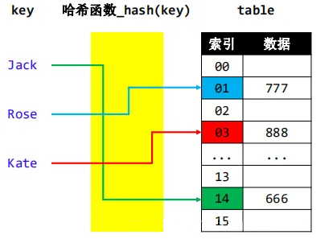
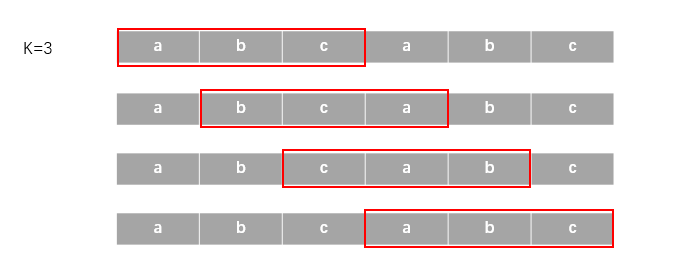

### 1639 · K-Substring with K different characters
Algorithms
Medium
Accepted Rate
36%


### Description
Given a string S and an integer K.
Calculate the number of substrings of length K and containing K different characters


## Example
```python
Input："abcabc"，k=3
Output：3
Explanation：
substrings:  ["abc", "bca", "cab"]

```
```python
Input："abacab"，k=3
Output：2
Explanation：
substrings: ["bac", "cab"]

```
### SOLVE this:

```python
class Solution:
    """
    @param string_in: The original string.
    @param k: The length of substrings.
    @return: return the count of substring of length K and exactly K distinct characters.
    """
    def k_substring(self, string_in: str, k: int) -> int:
        # Write your code here

```

### Tags
Hash Table
String


## Company
Amazon

### Related Problems
Related Problems

692
Sliding Window Unique Elements Sum
Medium


### best answer
```py
class Solution:
    """
    @param stringIn: The original string.
    @param K: The length of substrings.
    @return: return the count of substring of length K and exactly K distinct characters.
    """
    def KSubstring(self, stringIn, K):
        # Write your code here
        if not stringIn or K == 0:
            return []
            
        letter = {}
        res = set()
        start = 0
        
        for i in range(len(stringIn)):
            if stringIn[i] in letter and letter[stringIn[i]] >= start:
                start = letter[stringIn[i]] + 1 
            letter[stringIn[i]] = i 
            if i - start + 1 == K:
                res.add(stringIn[start:i+1])
                start += 1 
        return len(res)
```
//2 

```py
class Solution:
    """
    @param stringIn: The original string.
    @param K: The length of substrings.
    @return: return the count of substring of length K and exactly K distinct characters.
    """
    def KSubstring(self, stringIn, K):
        # Write your code here
        window = ''
        res = set()
        for s in stringIn:
            if s in window:
                window = window[window.index(s) + 1:]
            window += s
            if len(window) == K:
                res.add(window)
                window = window[1:]
        return len(res)
```
//3
```py
class Solution:
    """
    @param stringIn: The original string.
    @param K: The length of substrings.
    @return: return the count of substring of length K and exactly K distinct characters.
    """
    def KSubstring(self, stringIn, K):
        # Write your code here
        char = ""
        s = set()
        for c in stringIn:
            if len(char) == K:
                s.add(char)
                char = char[1:]
            if c in char:
                index = char.find(c)
                char = char[index+1:]
            char += c
        if len(char) == K:
            s.add(char)
        return len(s)
```


### Official answer from lintcode
解题思路
本题知识点：哈希表，滑动窗口。

哈希表简介
哈希表 是一种使用哈希函数组织数据的数据结构，它支持快速插入和搜索。

哈希表的原理
哈希表（又称为散列表）的原理为：借助 哈希函数，将键映射到存储桶地址。更确切地说，
首先开辟一定长度的，具有连续物理地址的桶数组；
当我们插入一个新的键时，哈希函数将决定该键应该分配到哪个桶中，并将该键存储在相应的桶中；
当我们想要搜索一个键时，哈希表将使用哈希函数来找到对应的桶，并在该桶中进行搜索。


哈希表的查找单个元素的时间复杂度为 
O
(
1
)
O(1)。

滑动窗口
顾名思义，滑动窗口就是一个动态的窗口，这个窗口可以是固定长度，也可以是可变长度，随具体问题而定。在这道题目中，我们可以保持窗口为固定长度 K，这样就只需要关心窗口边缘的字符就可以了。下面是图解：


解题方法：

维护两个哈希表，一个用于对最终结果的子串进行判重（哈希表 1），另一个用于计算每个长度为 K 的子串中的字符是否都不相同（哈希表 2）。
维持一个滑动窗口，长度为 K。当滑动时，维护哈希表 2 的状态。
当哈希表 2 的长度为 K 时，意味着这个子字符串满足题意，则将此子串放入哈希表 1 中。
滑动窗口移动到字符串的尾部结束后，哈希表 1 即为所求的满足题意的子串集合。 哈希表 1 的长度即为题目所求。直接返回即可。
复杂度分析
空间复杂度： 
O
(
N
⋅
K
)
O(N⋅K)。
N
N 为字符串长度，
K
K 为题意中的整数 
K
K。最终的子串集合的存储的最大可能空间为 
N
⋅
K
N⋅K。
时间复杂度： 
O
(
N
)
O(N)。对字符串的每个字符，查询和修改哈希表都为常数时间，所以总的时间复杂度为 
O
(
N
)
O(N)。

题解代码
```py
class Solution:
    """
    @param string_in: The original string.
    @param k: The length of substrings.
    @return: return the count of substring of length K and exactly K distinct characters.
    """
    def k_substring(self, string_in: str, k: int) -> int:
        # 特殊情况处理
        if k > len(string_in):
            return 0
        # 此哈希表中存储每个合法的子字符串。
        hash_set1 = set()
        # 此哈希表中存储每个子字符串的所有字符出现的次数，用于判重。
        hash_set2 = {}
        # 计算第一个子字符串。
        for i in range(k):
            c = string_in[i]
            if c in hash_set2.keys():
                hash_set2[c] += 1
            else:
                hash_set2[c] = 1
        if len(hash_set2) == k:
            hash_set1.add(string_in[0 : k])
        
        for i in range(k, len(string_in)):
            # 在判重的哈希表中加入最新的字符。
            c1 = string_in[i]
            if c1 in hash_set2.keys():
                hash_set2[c1] += 1
            else:
                hash_set2[c1] = 1
            # 在判重的哈希表中删除最前面的字符。
            c2 = string_in[i - k];
            if hash_set2[c2] == 1:
                del hash_set2[c2]
            else:
                hash_set2[c2] -= 1

            # 如果此子字符串符合题意，则放入哈希表。
            if len(hash_set2) == k:
                hash_set1.add(string_in[i - k + 1 : i + 1])
        # 返回哈希表的大小。
        return len(hash_set1)
```
//2
考点：

set
字符串处理
题解：

采用字典存放每个字符出现次数，维护每个k长度子串中的信息。先从头取k个长度的子串进行判断，当前字符出现次数为0，则对当前子串的字符种类数贡献为1，已经出现过则不计入。
然后从第k+1个字符开始，每次删除掉i-k处字符的信息，如果删除后，该字符出现次数为0，则子串中字符种类数减少。再对当前字符判断。当前字符如果出现次数为0，则对子串种类数贡献为1。
每次判断维护的k个长度的子串的字符种类数，如果为k就存入set，最后返回set的大小。
```py
class Solution:
    """
    @param stringIn: The original string.
    @param K: The length of substrings.
    @return: return the count of substring of length K and exactly K distinct characters.
    """
    def KSubstring(self, stringIn, K):
        # Write your code here
        map={}
        s=set()
        cnt=0
        for i in range( min( K , len(stringIn) ) ) :
            if stringIn[i] not in map.keys():
                cnt + = 1
                map[stringIn[i]] = 0
            map[stringIn[i]] + = 1
        if cnt == K:
           s.add(stringIn[ : K])
        for i in range(K , max(K , len(stringIn))):
            map[stringIn[i-K]] - = 1
            if map[stringIn[i-K]] == 0:
                cnt -= 1
            if stringIn[i] not in map.keys() or map[stringIn[i]] == 0:
                cnt += 1
                map[stringIn[i]] = 0
            map[stringIn[i]] += 1
            if cnt == K:
                s.add(stringIn[i-K+1 : i+1])
        return len(s)
```
//3
滑动窗口法解决，注意用首尾index表示当前字符串

直接从原始字符串提取答案，这样可以节省拼接字符串的时间
```py
def k_substring(self, s: str, k: int) -> int:
    d, ans, i = set(), set(), 0
    for j in range(len(s)):
        while i<j and (s[j] in d or len(d)>=k):
            d.remove(s[i])
            i += 1
        d.add(s[j])
        if len(d)==k:
            ans.add(s[i:j+1])
    return len(ans)
```